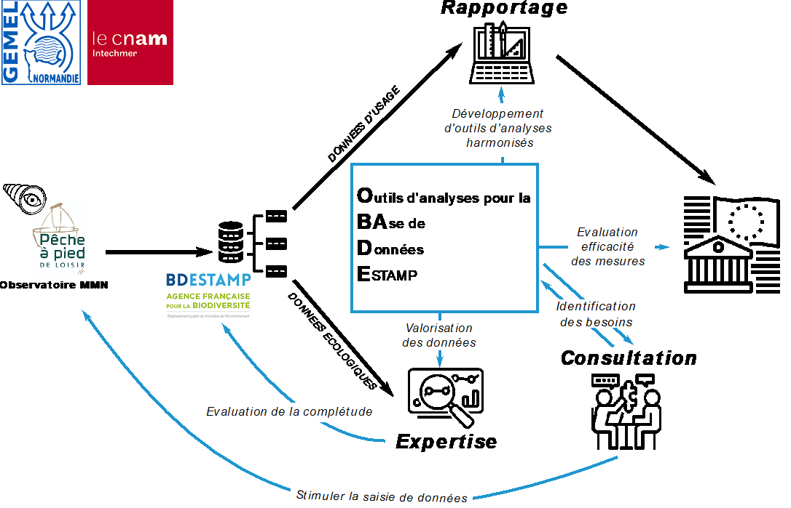

---
title: "OBADE : Outils d analyses pour la BAse de Données ESTAMP"
---    

> **Appel à projet** :  Ministère de la Transition Ecologique et Solidaire   
> **Financement** :  DREAL Normandie  
> **Porteurs de projet** :  GEMEL Normandie et le cnam/Intechmer

# Contexte
En mai 2019, le Ministère de la Transition Ecologique et Solidaire a emis un appel à projet *Acquisition de connaissances sur le milieu marin en appui à la mise en oeuvre de la directive-cadre « stratégie pour le milieu marin »*.(DCSMM, 2008/56/CE).

La DCSMM a pour objectif l'atteinte ou le maintien du bon état écologique des eaux marines européennes d'ici 2020. La mise en oeuvre de cette directive est structurée en cinq volets : 
1. une évaluation (écologique et socio-économique)
2. une définition du bon état écologique des eaux marines
3. l'établissement d'objectifs environnementaux
4. la mise en oeuvre de programmes de surveillance et de programmes de mesures. 
L'ensemble de ces éléments est révisé tous les 6 ans.
Les connaissances sur l'état du milieu marin, sur les pressions qui s'y exercent et sur l'efficacité des mesures de gestion sont encore lacunaires.

#### Objectif de l'appel à projet
> **Evaluation de l’efficacité écologique et économique de mesures de gestion prises en faveur de l’environnement marin.**

# Péche à pied de Loisir 

La pêche à pied de loisir est l’une des activités les plus pratiquées sur le littoral français (par environ 1,7 million de personnes selon l’étude de l’Ifremer et de l’Institut BVA en 2008).
Elle occupe une position centrale dans les stratégies de développement local pour deux raisons au moins. D’une part, parce qu’elle mobilise des savoirs et des savoir-faire hérités qui s’intègrent dans le patrimoine maritime régional.
Une pression de pêche élevée associée à de mauvaises pratiques peut être à l’origine de la dégradation du milieu littoral, de la raréfaction de la ressource – qui peut être identifiée à une perte patrimoniale (biodiversité) – et à une perte d’attractivité du territoire (économie, qualité de vie). 

La mesure de gestion *"Mettre en place un observatoire des activités de pêche à pied de loisir dans la sous-région marine"* ([M308-MMN2](http://www.dirm.memn.developpement-durable.gouv.fr/IMG/pdf/m308-mmn2_document-cadre_de_prefiguration_de_l_observatoire-post_procedure_passation_marches.pdf)) a pour objectif de pérenniser les initiatives existantes de suivi des activités de pêche à pied de loisir sur le littoral de la sous-région marine Manche Mer du Nord (qui s’étend du département du Finistère nord (Audierne) au département du Nord). Pour se faire un réseaux d'acteurs (Associations, collectivités...) realise des comptages et des enquétes.
Les données de ces démarches sont bancarisées par les opérateurs de l'observatoire dans la base de données [BD ESTAMP](https://estamp.afbiodiversite.fr).
L’application BD ESTAMP a été développée afin d'héberger les données issues des suivis écologiques et d’usages, réalisés sur la frange côtière intertidale au sein des aires marines protégées.
Le coordinateur de l'observatoire et les coordinateurs locaux doivent réaliser l’analyse des comptages et enquêtes.

# OBADE : Outils d analyses pour la BAse de Données ESTAMP

OBADE propose de faciliter l'analyse des données biologiques et sociales présentes dans la base de données [BD ESTAMP](https://estamp.afbiodiversite.fr) afin de mesurer l’efficacité de certaines mesures du Plan d'Action pour le Milieu Marin (PAMM) Manche-mer du Nord ([M308-MMN2](http://www.dirm.memn.developpement-durable.gouv.fr/IMG/pdf/m308-mmn2_document-cadre_de_prefiguration_de_l_observatoire-post_procedure_passation_marches.pdf), [M307-MMN2](http://www.dirm.memn.developpement-durable.gouv.fr/preuves-objectives-de-realisation-des-actions-des-a924.html) et [M402-ATL2](http://www.dirm.memn.developpement-durable.gouv.fr/preuves-objectives-de-realisation-des-actions-des-a924.html)) et de développer un outil informatique permettant **i)** de réaliser des analyses scientifiquement robustes et **ii)** d’être utilisé par tout un chacun sans nécessité de compétences en analyses de données.
Il s’articule de la manière suivante : 

- Un volet **Rapportage**, qui consiste en la création d’un outil automatique d’analyse des **données d’usage** qui en interrogeant la BD ESTAMP produira graphiques, statistiques et cartes. Cet outil permettrait d’harmoniser les pratiques, de valider la représentativité des données et de faciliter le rapportage pour animer l’Observatoire.

- Un volet **Expertise**, qui consiste à analyser les **données écologiques** (ressources et habitats) et les **données d’usages** disponibles, valides, qualifiées et robustes de la BD ESTAMP. Ce volet permettra d’évaluer l’efficacité de l’Observatoire sur les ressources et/ou les habitats en les confrontant aux données de fréquentation et de sensibilisation.

Une interface Web (Shiny) permettra aux coordinateurs d'interroger la base de donnée ESTAMP et de récuperer un fichier (Word) résumant de façon simple et accessible (graphique, tableau, statistique...) les données. OBADE est un donc un outil pour guider l'interprétation de données de l'observatoire de la péche à pied.

 

 
