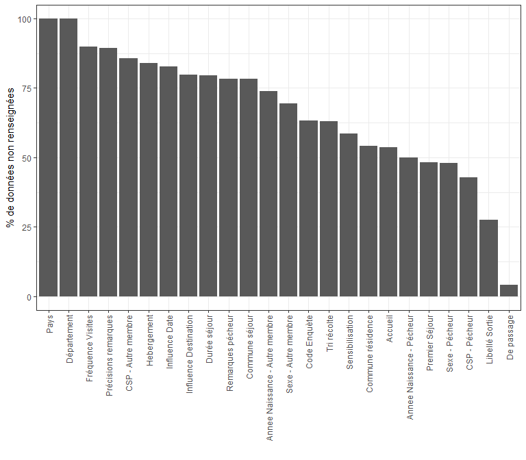
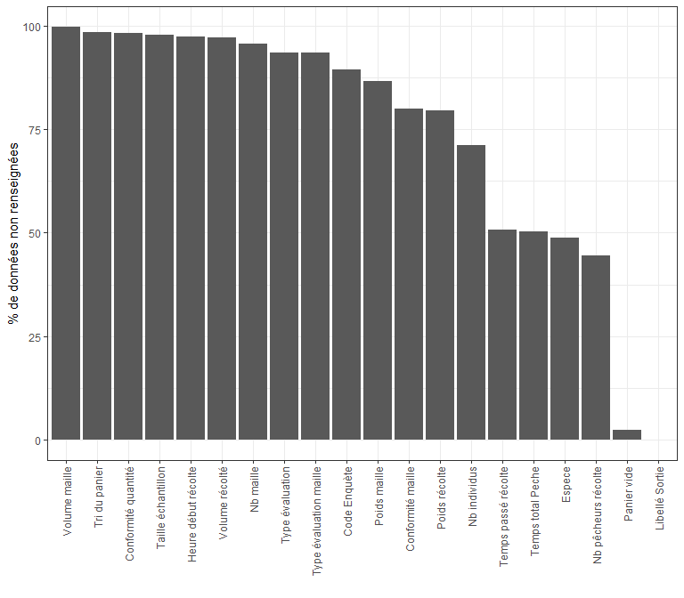
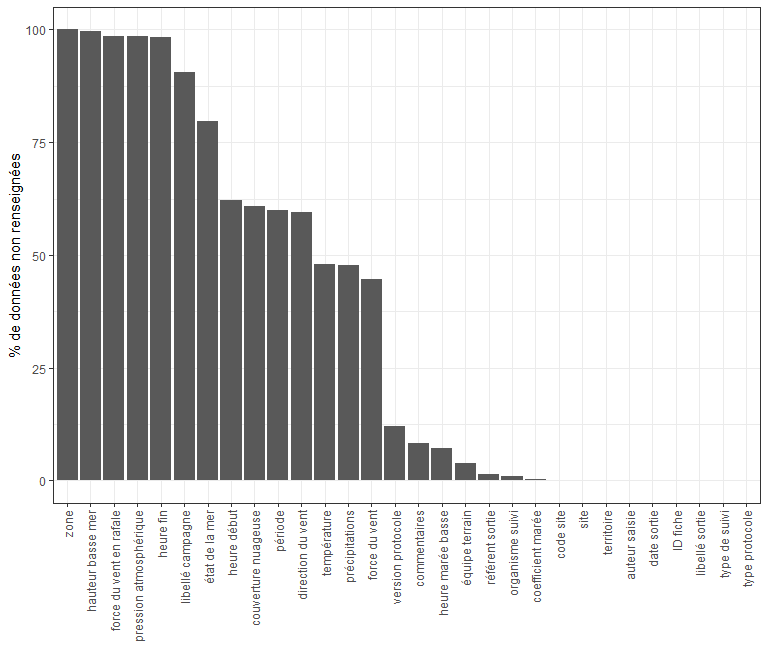
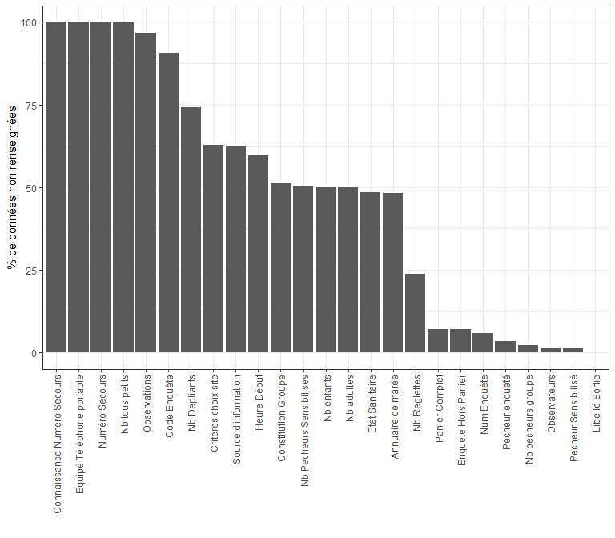
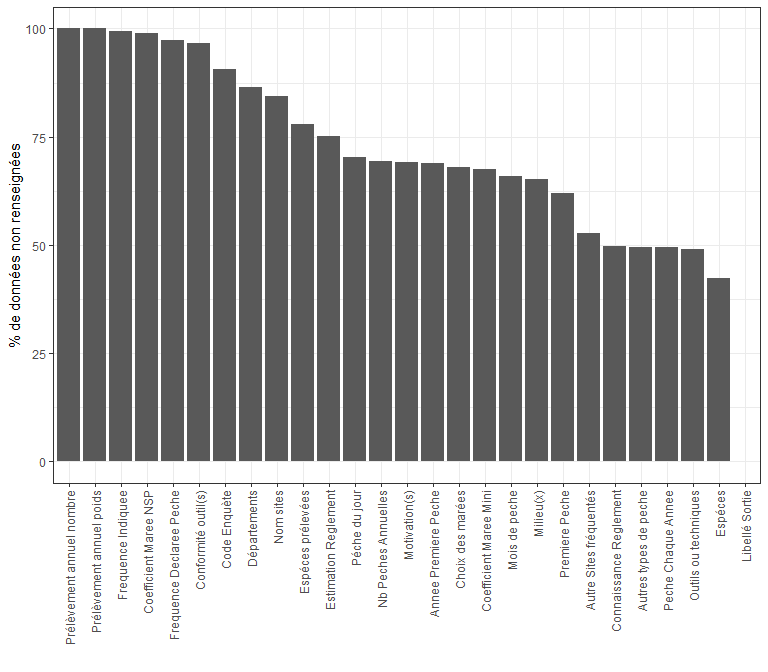
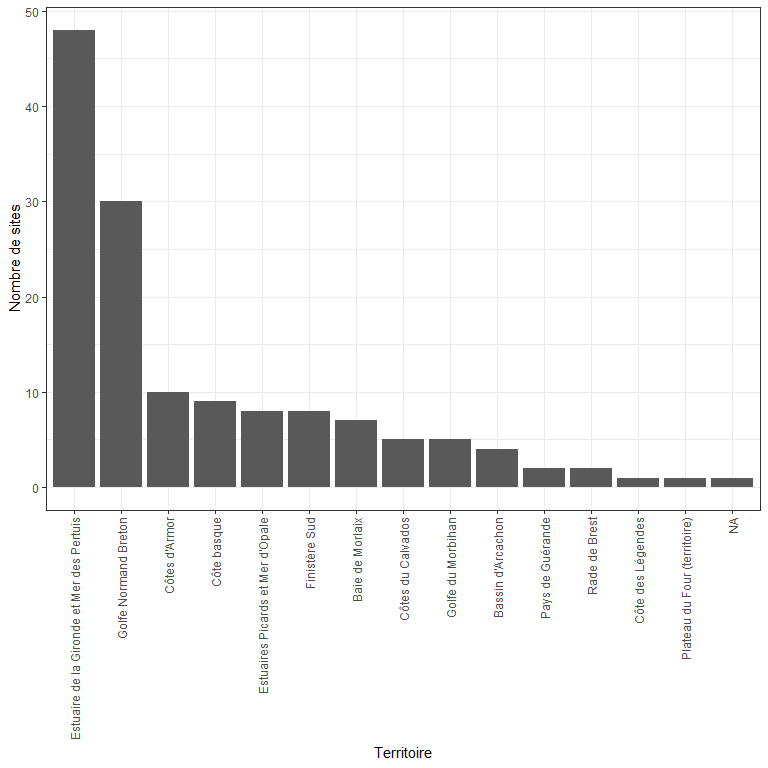

## Contexte (à developper)

- observatoire de la pêche à pieds
- base de données ESTAMP
- description de la base
- si lacunes -> localisation spatio-temporelle

On se focalise principalement sur les données de "pêche à pieds"


### 1 Description des données extraites

#### 1.1 `enquete_detail.csv`

Le jeu de données `enquete_detail.csv` est composé de 13392 lignes (= observations) et 27 colonnes (= variables)

<div class="kable-table">

Variable                         Class        Nombre_Elements   Nombre_NA  Description                                                                                                                                                                
-------------------------------  ----------  ----------------  ----------  ---------------------------------------------------------------------------------------------------------------------------------------------------------------------------
Libellé Sortie                   character              10767        4142  Arcouest_01/03/2014_Dominique Rault_2                                                                                                                                      
Code Enquète                     character               3865        9529  Arcouest_01/03/2014_Christelle Barth_1                                                                                                                                     
Commune résidence                character               1780        8183  MORDELLES                                                                                                                                                                  
Département                      character                  9       15077  13 - Bouches-du-Rhône : 1 - 14 - Calvados : 4 - 27 - Eure : 2 - 37 - Indre-et-Loire : 1 - 50 - Manche : 1 - 77 - Seine-et-Marne : 1 - 78 - Yvelines : 1 - 91 - Essonne : 1 
Pays                             character                  3       15086  Allemagne : 1 - France : 2                                                                                                                                                 
De passage                       character                  4         623  en séjour sur une commune : 10993 - Non renseigné : 12 - pour la journée : 3461                                                                                            
Commune séjour                   character                372       11811  PAIMPOL                                                                                                                                                                    
Durée séjour                     integer                   55       12019  1                                                                                                                                                                          
Hebergement                      character                  8       12682  Bateau : 24 - Camping : 593 - Camping car : 279 - Famille/Amis : 392 - Location/Hotel : 424 - Résidence secondaire : 602 - Terrain privé : 93                              
Premier Séjour                   character                  4        7273  Non : 3236 - Non renseigné : 4163 - Oui : 417                                                                                                                              
Fréquence Visites                numeric                   38       13552  1                                                                                                                                                                          
Influence Destination            character                  4       12043  Non, secondaire : 1886 - Oui, déterminant : 663 - Oui, en partie : 497                                                                                                     
Influence Date                   character                  4       12481  Non, secondaire : 1834 - Oui, déterminant : 489 - Oui, en partie : 285                                                                                                     
Sexe - Pécheur                   character                  4        7234  F : 4849 - M : 2985 - Non renseigné : 21                                                                                                                                   
Annee Naissance - Pécheur        integer                   82        7556  1944                                                                                                                                                                       
CSP - Pécheur                    character                 21        6474  7_Retraités                                                                                                                                                                
Sexe - Autre membre              character                  3       10468  F : 2378 - M : 2243                                                                                                                                                        
Annee Naissance - Autre membre   integer                   92       11164  1936                                                                                                                                                                       
CSP - Autre membre               character                 21       12929  7_Retraités                                                                                                                                                                
Tri récolte                      character                  7        9526  Non Triée : 1730 - Panier vide : 255 - Récolte conforme : 278 - Récolte non vérifiée : 523 - Tri complet : 1331 - Tri partiel : 1446                                       
Accueil                          character                  5        8081  Bon : 5996 - Mauvais : 14 - Moyen : 677 - Refus : 321                                                                                                                      
Sensibilisation                  character                  5        8822  Moyen : 852 - Non : 661 - Non renseigné : 2 - Oui : 4752                                                                                                                   
Remarques pécheur                character                 14       11827  Ressource/Environnement                                                                                                                                                    
Précisions remarques             character               1160       13486  Intéressé par le panneau mis en place                                                                                                                                      

</div>

<!-- -->


#### 1.2 `enquete_peche_jour.csv`


Le jeu de données `enquete_peche_jour.csv` est composé de 15707 lignes (= observations) et 20 colonnes (= variables)

<div class="kable-table">

Variable                 Class        Nombre_Elements   Nombre_NA  Description                                                                           
-----------------------  ----------  ----------------  ----------  --------------------------------------------------------------------------------------
Libellé Sortie           character              13360           0  Arcouest_01/03/2014_Christelle Barth_1                                                
Code Enquète             character               1259       14065  2018-04-16_EGMP_116_355807                                                            
Heure début récolte      hms                       66       15300  16:30:00                                                                              
Temps passé récolte      numeric                  133        7983  45                                                                                    
Temps total Peche        numeric                  105        7907  75                                                                                    
Nb pêcheurs récolte      numeric                   17        6980  1                                                                                     
Panier vide              character                  4         355  Non : 10716 - Non renseigné : 3338 - Oui : 1298                                       
Conformité maille        character                  4       12573  Conformité < 50% : 475 - Conformité > 90% : 1612 - Conformité entre 50% et 90% : 1047 
Conformité quantité      character                  4       15457  Conforme : 4 - Non Conforme : 224 - Non renseigné : 22                                
Tri du panier            character                  5       15479  Complet : 167 - Non réalisé : 17 - Non renseigné : 8 - Partiel : 36                   
Espece                   character                 72        7682  Praire                                                                                
Poids récolte            numeric                  576       12513  100                                                                                   
Nb individus             numeric                  187       11172  2                                                                                     
Volume récolté           numeric                   69       15275  2                                                                                     
Type évaluation          character                  4       14683  Estimée : 64 - Mesurée : 324 - Non renseignée : 636                                   
Poids maille             character                905       13628  100.0                                                                                 
Nb maille                numeric                   84       15050  20                                                                                    
Volume maille            numeric                   20       15679  2.5                                                                                   
Type évaluation maille   character                  4       14683  Estimée : 65 - Mesurée : 310 - Non renseignée : 649                                   
Taille échantillon       numeric                   18       15360  100                                                                                   

</div>

<!-- -->


#### 1.3 `ficheterrain.csv`


Le jeu de données `ficheterrain.csv` est composé de 13408 lignes (= observations) et 30 colonnes (= variables)

<div class="kable-table">

Variable                  Class        Nombre_Elements   Nombre_NA  Description                                                                                                                                                                                                                                                                                                                                                                                                                 
------------------------  ----------  ----------------  ----------  ----------------------------------------------------------------------------------------------------------------------------------------------------------------------------------------------------------------------------------------------------------------------------------------------------------------------------------------------------------------------------------------------------------------------------
ID fiche                  character              13408           0  268946                                                                                                                                                                                                                                                                                                                                                                                                                      
type de suivi             character                  1           0  Suivi des enquêtes pêcheurs à pied : 13408                                                                                                                                                                                                                                                                                                                                                                                  
date sortie               POSIXct                  601           0  2014-03-01                                                                                                                                                                                                                                                                                                                                                                                                                  
heure début               hms                      450        8346  14:00:00                                                                                                                                                                                                                                                                                                                                                                                                                    
heure fin                 hms                       31       13175  19:00:00                                                                                                                                                                                                                                                                                                                                                                                                                    
coefficient marée         integer                   80          39  112                                                                                                                                                                                                                                                                                                                                                                                                                         
heure marée basse         hms                      465         974  14:36:00                                                                                                                                                                                                                                                                                                                                                                                                                    
hauteur basse mer         numeric                    6       13364  0.6 : 1 - 1.21 : 6 - 1.29 : 26 - 1.37 : 10 - 9.29 : 1                                                                                                                                                                                                                                                                                                                                                                       
période                   character                  4        8051  Semaine : 1583 - Vacances : 3330 - Week-end ou Jour Férié : 444                                                                                                                                                                                                                                                                                                                                                             
libellé campagne          character                 20       12144  avr-18                                                                                                                                                                                                                                                                                                                                                                                                                      
libellé sortie            character              13365           0  Arcouest_01/03/2014_Christelle Barth_1                                                                                                                                                                                                                                                                                                                                                                                      
référent sortie           character                397         184  Christelle Barth                                                                                                                                                                                                                                                                                                                                                                                                            
équipe terrain            character                441         516  Christelle Barth                                                                                                                                                                                                                                                                                                                                                                                                            
territoire                character                 15          19  Côtes d'Armor                                                                                                                                                                                                                                                                                                                                                                                                               
code site                 character                141          19  ARMO_089                                                                                                                                                                                                                                                                                                                                                                                                                    
site                      character                141          19  Arcouest                                                                                                                                                                                                                                                                                                                                                                                                                    
zone                      character                  1       13408  :                                                                                                                                                                                                                                                                                                                                                                                                                           
type protocole            character                  2           0  Enquête complète : 6931 - Enquête sensibilisation : 6477                                                                                                                                                                                                                                                                                                                                                                    
version protocole         character                 37        1605  QlittOuest22_V03.2014                                                                                                                                                                                                                                                                                                                                                                                                       
auteur saisie             character                 12           0  SYSTEME                                                                                                                                                                                                                                                                                                                                                                                                                     
organisme suivi           character                 20         127  VivArmor Nature                                                                                                                                                                                                                                                                                                                                                                                                             
couverture nuageuse       character                  5        8156  0-25% (Peu ou pas nuageux) : 1969 - 25-75% (Nuageux) : 1787 - 75-100% (Très nuageux) : 1357 - Brouillard : 139                                                                                                                                                                                                                                                                                                              
précipitations            character                  6        6395  Averses violentes ou orageuses - Grêles ou neige : 52 - Pas de précipitation : 6591 - Pluie continue : 35 - Pluie fine : 216 - Pluies éparses : 119                                                                                                                                                                                                                                                                         
pression atmosphérique    numeric                   23       13201  1023                                                                                                                                                                                                                                                                                                                                                                                                                        
température               numeric                  124        6445  20                                                                                                                                                                                                                                                                                                                                                                                                                          
force du vent             character                  8        5982  0-Calme-1 km/h-Mer d'huile : 103 - 1-Très légère brise-1 à 5 km/h-Mer ridée : 563 - 2-Lègère brise-6 à 11 km/h-Vaguelettes : 1318 - 3-Petite brise-12 à 19 km/h-Très petites vagues. Déferlement. : 3215 - 4-Jolie brise-20 à 28 km/h-Petites vagues. Moutons. : 1665 - 5-Bonne brise-29 à 38 km/h-Vagues modérées. : 522 - 6-Vent frais-39 à 49 km/h-Crêtes d'écume blanches. : 40                                         
force du vent en rafale   character                  9       13220  0-Calme-1 km/h-Mer d'huile : 3 - 1-Très légère brise-1 à 5 km/h-Mer ridée : 4 - 2-Lègère brise-6 à 11 km/h-Vaguelettes : 76 - 3-Petite brise-12 à 19 km/h-Très petites vagues. Déferlement. : 45 - 4-Jolie brise-20 à 28 km/h-Petites vagues. Moutons. : 39 - 5-Bonne brise-29 à 38 km/h-Vagues modérées. : 14 - 6-Vent frais-39 à 49 km/h-Crêtes d'écume blanches. : 6 - 7-Grand frais-50 à 61 km/h- Lames déferlantes : 1 
direction du vent         character                  9        7980  Est : 310 - Nord : 230 - Nord-Est : 821 - Nord-Ouest : 1837 - Ouest : 849 - Sud : 261 - Sud-Est : 330 - Sud-Ouest : 790                                                                                                                                                                                                                                                                                                     
état de la mer            character                  7       10676  0-calme-0 m : 307 - 1-ridée-0 à 0,1 m : 952 - 2-belle-0,1 à 0,5 m : 800 - 3-peu agitée-0,5 à 1,25 m : 642 - 4-agitée-1,25 à 2,5 m : 26 - 5-forte-2,5 à 4 m : 5                                                                                                                                                                                                                                                              
commentaires              character                 38        1102  Reprise de données Enquete                                                                                                                                                                                                                                                                                                                                                                                                  

</div>

<!-- -->


#### 1.4 `enquete_preparation_peche.csv`


Le jeu de données `enquete_preparation_peche.csv` est composé de 13403 lignes (= observations) et 25 colonnes (= variables)

<div class="kable-table">

Variable                      Class        Nombre_Elements   Nombre_NA  Description                                                                          
----------------------------  ----------  ----------------  ----------  -------------------------------------------------------------------------------------
Libellé Sortie                character              13361           0  Arcouest_01/03/2014_Christelle Barth_1                                               
Code Enquète                  character               1260       12144  2018-04-16_EGMP_116_355807                                                           
Observateurs                  character                486         184  Christelle Barth                                                                     
Num Enquéte                   character               7030         805  1.0                                                                                  
Heure Début                   hms                      466        7991  14:00:00                                                                             
Enquete Hors Panier           character                  4         939  Non : 1 - Non renseigné : 12217 - Oui : 246                                          
Panier Complet                character                  4         944  Non : 131 - Non renseigné : 12221 - Oui : 107                                        
Pecheur Sensibilisé           character                  4         162  Non : 805 - Non renseigné : 12242 - Oui : 194                                        
Pecheur enqueté               character                  4         479  Non : 592 - Non renseigné : 12307 - Oui : 25                                         
Constitution Groupe           character                  5        6893  En couple : 1313 - En famille : 1722 - En groupe d'amis : 1153 - Pêcheur seul : 2322 
Nb adultes                    integer                   19        6731  3                                                                                    
Nb enfants                    integer                   15        6732  0                                                                                    
Nb tous petits                integer                    2       13397  0 : 6                                                                                
Nb pecheurs groupe            integer                   35         293  3                                                                                    
Nb Pecheurs Sensibilises      integer                   89        6767  2                                                                                    
Nb Reglettes                  integer                   79        3207  0                                                                                    
Nb Depliants                  integer                    9        9940  0 : 2664 - 1 : 654 - 2 : 119 - 3 : 12 - 4 : 8 - 5 : 3 - 7 : 2 - 12 : 1               
Observations                  character                351       12964  fait découvrir le coin aux enfants                                                   
Annuaire de marée             character                  4        6476  Non : 397 - Non renseigné : 976 - Oui : 5554                                         
Etat Sanitaire                character                  4        6492  NC : 1108 - Non : 4102 - Oui : 1701                                                  
Source d'information          character                 41        8399  Médias (journaux, radios, tv)                                                        
Equipé Téléphone portable     character                  1       13403  :                                                                                    
Connaissance Numéro Secours   character                  1       13403  :                                                                                    
Numéro Secours                character                  1       13403  :                                                                                    
Critéres choix site           character                 73        8411  Proximité                                                                            

</div>

<!-- -->

#### 1.5 `enquete_pratique_peche.csv`


Le jeu de données `enquete_pratique_peche.csv` est composé de 13392 lignes (= observations) et 27 colonnes (= variables)

<div class="kable-table">

Variable                    Class        Nombre_Elements   Nombre_NA  Description                                                                                                                                   
--------------------------  ----------  ----------------  ----------  ----------------------------------------------------------------------------------------------------------------------------------------------
Libellé Sortie              character              13350           0  Arcouest_01/03/2014_Christelle Barth_1                                                                                                        
Code Enquète                character               1249       12144  2018-04-16_EGMP_116_355807                                                                                                                    
Milieu(x)                   character                241        8736  Flaques rocheuses                                                                                                                             
Espéces                     character                627        5685  Praire                                                                                                                                        
Outils ou techniques        character                327        6561  Rateau                                                                                                                                        
Conformité outil(s)         character                  4       12936  Conforme : 382 - Non conforme : 48 - Non renseigné : 26                                                                                       
Estimation Reglement        character                  5       10077  Ne Sait Pas : 530 - Non : 183 - Non Resnseigné : 167 - Oui : 2435                                                                             
Connaissance Reglement      character                  4        6670  Non : 837 - Non Renseigné : 3583 - Oui : 2302                                                                                                 
Premiere Peche              character                  4        8289  Non : 4822 - Non Renseigné : 60 - Oui : 221                                                                                                   
Annee Premiere Peche        integer                   87        9216  1964                                                                                                                                          
Peche Chaque Annee          character                  4        6623  Non : 612 - Non Renseigné : 1870 - Oui : 4287                                                                                                 
Frequence Declaree Peche    numeric                   37       13036  1                                                                                                                                             
Mois de peche               character                325        8824  Fev | Oct                                                                                                                                     
Nb Peches Annuelles         numeric                   64        9282  2                                                                                                                                             
Péche du jour               character                  7        9416  Occasionnelle (>5%) : 475 - Première fois : 161 - Principale (>60%) : 1629 - Rare (<5%) : 104 - Régulière (>25%) : 795 - Seule pratique : 812 
Frequence Indiquee          character                 11       13307  1.0                                                                                                                                           
Espéces prélevées           character                848       10421  Coque commune                                                                                                                                 
Prélèvement annuel poids    character                  3       13390  0.0 : 1 - 2700.0 : 1                                                                                                                          
Prélèvement annuel nombre   character                  3       13390  0 : 1 - 2 : 1                                                                                                                                 
Choix des marées            character                 14        9108  Uniquement aux grandes marées                                                                                                                 
Coefficient Maree Mini      integer                   56        9037  100                                                                                                                                           
Coefficient Maree NSP       character                  2       13242  Ne Sait pas : 150                                                                                                                             
Autre Sites fréquentés      character                  4        7075  Non : 1725 - Non Renseigné : 1907 - Oui : 2685                                                                                                
Départements                character                 69       11578  Loire-Atlantique                                                                                                                              
Nom sites                   character               1356       11315  Pointe de Guilben. 44 (NR)                                                                                                                    
Motivation(s)               character                103        9271  Qualité des produits | Plaisir : aspect ludique                                                                                               
Autres types de peche       character                 38        6636  Aucune autre pêche                                                                                                                            

</div>

<!-- -->


### **Points importants :**

 - Au total 486 observateurs[^1] répartis selon les 15 territoires. Grande hétérogénéité dans la dénomination des observateurs qui peut poser un problème dans certains cas pour retrouver le ou les observateur(s).


<div class="kable-table">

territoire                                     n
------------------------------------------  ----
Baie de Morlaix                               47
Bassin d'Arcachon                              6
Côte basque                                    9
Côte des Légendes                              3
Côtes d'Armor                                 93
Côtes du Calvados                              5
Estuaire de la Gironde et Mer des Pertuis    117
Estuaires Picards et Mer d'Opale              12
Finistère Sud                                 35
Golfe du Morbihan                              7
Golfe Normand Breton                          91
Pays de Guérande                              43
Plateau du Four (territoire)                  12
Rade de Brest                                 45
NA                                             5

</div>

- Sur les 119 variables, 51 possèdent moins de 50% d'observations non renseignées (`NA`). 


```
## [1] "Libellé Sortie  Code Enquète.x  Observateurs  Num Enquéte  Enquete Hors Panier  Panier Complet  Pecheur Sensibilisé  Pecheur enqueté  Constitution Groupe  Nb pecheurs groupe  Annuaire de marée  Etat Sanitaire  Source d'information  Critéres choix site  ID fiche  type de suivi  date sortie  coefficient marée  heure marée basse  période  libellé campagne  référent sortie  territoire  code site  site  type protocole  version protocole  auteur saisie  Milieu(x)  Espéces  Outils ou techniques  Estimation Reglement  Connaissance Reglement  Peche Chaque Annee  Nb Peches Annuelles  Choix des marées  Coefficient Maree Mini  Motivation(s)  Autres types de peche  Temps passé récolte  Temps total Peche  Nb pêcheurs récolte  Panier vide  Espece  Type évaluation  Type évaluation maille  Commune résidence  De passage  Sexe - Pécheur  Annee Naissance - Pécheur  CSP - Pécheur"
```


[^1]: La liste des observateurs sera disponible en annexe


### 2. Emprise temporelle et spatiale

#### 2.1 Emprise spatiale

<!-- -->


#### 2.2 Emprise temporelle


Les dates sont localisées dans le jeu de données `ficheterrain.csv`.


<!--html_preserve--><div id="htmlwidget-5b935485854833d2ff7a" style="width:768px;height:576px;" class="plotly html-widget"></div>
<script type="application/json" data-for="htmlwidget-5b935485854833d2ff7a">{"x":{"data":[{"x":[1388707200,1389916800,1391040000,1391472000,1392508800,1392595200,1392681600,1393545600,1393632000,1393718400,1393804800,1393891200,1393977600,1395014400,1395100800,1395187200,1396051200,1396137600,1396224000,1396310400,1396396800,1396569600,1397347200,1397433600,1397520000,1397606400,1397692800,1397779200,1398124800,1398211200,1398297600,1398643200,1398729600,1398816000,1398902400,1398988800,1399766400,1399852800,1399939200,1400025600,1400112000,1400198400,1400284800,1400457600,1401062400,1401148800,1401235200,1401321600,1401408000,1401494400,1401580800,1401753600,1402444800,1402531200,1402617600,1402704000,1402790400,1402876800,1402963200,1403049600,1403654400,1403740800,1403827200,1403913600,1404000000,1404086400,1404172800,1404259200,1404864000,1404950400,1405036800,1405123200,1405209600,1405296000,1405382400,1405468800,1405555200,1406160000,1406246400,1406332800,1406419200,1406505600,1406592000,1406678400,1406764800,1406851200,1407110400,1407196800,1407369600,1407456000,1407542400,1407628800,1407715200,1407801600,1407888000,1407974400,1408060800,1408147200,1408320000,1408665600,1408924800,1409011200,1409097600,1409184000,1409270400,1409961600,1410048000,1410134400,1410220800,1410307200,1410393600,1410480000,1410566400,1410652800,1410739200,1410825600,1411084800,1411344000,1411430400,1411516800,1411603200,1411689600,1411862400,1412553600,1412640000,1412726400,1412812800,1412899200,1412985600,1414022400,1414108800,1414195200,1414368000,1415059200,1415145600,1415232000,1415318400,1416355200,1416787200,1417478400,1417651200,1417737600,1417996800,1418083200,1419206400,1419379200,1420675200,1421712000,1421798400,1421884800,1421971200,1423008000,1424131200,1424217600,1424304000,1424390400,1424476800,1424563200,1425254400,1425340800,1425513600,1425600000,1426032000,1426550400,1426723200,1426809600,1426896000,1426982400,1427846400,1427932800,1428105600,1428537600,1429056000,1429142400,1429228800,1429315200,1429401600,1429488000,1429574400,1429660800,1430352000,1430697600,1430784000,1430870400,1430956800,1431129600,1431216000,1431648000,1431734400,1431820800,1431907200,1431993600,1432080000,1432252800,1433116800,1433203200,1433289600,1433376000,1433462400,1433548800,1433635200,1433721600,1434326400,1434412800,1434499200,1434672000,1434758400,1434844800,1435017600,1435449600,1435708800,1435795200,1435881600,1435968000,1436054400,1436140800,1436227200,1436313600,1436400000,1436745600,1436918400,1437004800,1437091200,1437177600,1437264000,1437350400,1437436800,1437523200,1437609600,1437696000,1437955200,1438041600,1438128000,1438214400,1438300800,1438387200,1438473600,1438560000,1438646400,1438732800,1438819200,1439251200,1439337600,1439424000,1439596800,1439683200,1439769600,1439856000,1439942400,1440028800,1440115200,1440633600,1440720000,1440806400,1440892800,1440979200,1441065600,1441152000,1441238400,1441324800,1441843200,1441929600,1442016000,1442102400,1442188800,1442275200,1442448000,1443139200,1443225600,1443312000,1443398400,1443484800,1443571200,1443657600,1443744000,1444867200,1445040000,1445299200,1445385600,1445644800,1445731200,1445817600,1445904000,1445990400,1446076800,1446163200,1448323200,1448409600,1448496000,1448755200,1448841600,1449792000,1449878400,1449964800,1450051200,1450915200,1451088000,1451174400,1451260800,1451347200,1453334400,1453507200,1453680000,1453766400,1454198400,1454976000,1455062400,1455148800,1455580800,1455840000,1456099200,1456272000,1456358400,1457308800,1457395200,1457481600,1457568000,1457654400,1457740800,1457913600,1458000000,1458518400,1458604800,1458691200,1458777600,1458864000,1459209600,1459814400,1459900800,1459987200,1460073600,1460160000,1460246400,1460332800,1460419200,1461024000,1461110400,1461196800,1461283200,1461369600,1461456000,1461542400,1461628800,1461715200,1461801600,1462320000,1462406400,1462492800,1462579200,1462665600,1462752000,1462838400,1463011200,1463097600,1463616000,1463702400,1463788800,1463961600,1464048000,1464134400,1464307200,1464393600,1464566400,1464739200,1464912000,1464998400,1465084800,1465171200,1465257600,1465344000,1465430400,1465603200,1465689600,1466121600,1466208000,1466380800,1466467200,1466553600,1466640000,1466726400,1466985600,1467158400,1467244800,1467504000,1467590400,1467676800,1467763200,1467849600,1467936000,1468022400,1468195200,1468368000,1468800000,1468886400,1468972800,1469059200,1469145600,1469232000,1469318400,1469404800,1469491200,1469577600,1470009600,1470096000,1470182400,1470268800,1470355200,1470441600,1470528000,1470614400,1470700800,1470787200,1470873600,1471305600,1471392000,1471478400,1471564800,1471651200,1471737600,1471824000,1471910400,1471996800,1472083200,1472428800,1472601600,1472688000,1472774400,1472860800,1473033600,1473120000,1473292800,1473897600,1473984000,1474070400,1474156800,1474243200,1474329600,1474502400,1475020800,1475107200,1475193600,1475280000,1475366400,1475452800,1475539200,1475625600,1475712000,1476316800,1476403200,1476489600,1476576000,1476662400,1476835200,1476921600,1477008000,1477612800,1477872000,1478044800,1478131200,1479081600,1479168000,1479254400,1480550400,1480636800,1480723200,1481587200,1481673600,1481846400,1504656000,1504742400,1504828800,1505088000,1505692800,1505779200,1505865600,1505952000,1506297600,1507161600,1523836800,1524009600,1524096000,1524614400,1524787200,1526428800,1526601600,1527206400,1527638400,1528156800,1528243200,1528848000,1528934400,1529020800,1529539200,1529625600,1530057600,1530230400,1530489600,1531267200,1531353600,1531440000,1531526400,1531612800,1531699200,1531785600,1532390400,1532563200,1532908800,1533859200,1533945600,1534032000,1534118400,1534204800,1534377600,1534809600,1534982400,1535068800,1535328000,1535414400,1535500800,1535673600,1535760000,1536105600,1536192000,1536278400,1536537600,1536624000,1536710400,1536796800,1537315200,1537488000,1537747200,1537833600,1537920000,1538006400,1538697600,1538956800,1539043200,1539129600,1539216000,1539302400,1539907200,1540166400,1540425600,1540512000,1540771200,1541462400,1541548800,1541635200,1541980800,1542758400,1542931200,1543017600,1543190400,1544486400,1546992000,1547769600,1548028800,1548288000,1549324800,1549411200,1549497600,1549929600,1550793600,1551139200,1551225600,1551744000,1552348800,1552435200,1552953600,1553126400,1553212800,1553299200,1553558400,1555545600,1555632000,1555718400,1555804800,1557100800,1557187200,1559520000,1559606400,1562112000,1562198400,1562284800,1562716800,1563408000,1564617600,1564704000,1564876800,1564963200,1566259200,1567123200,1567209600,1567296000,1567382400,1569628800,1569801600,1569888000,1572220800,1572307200,1572393600],"y":[1,1,1,2,1,2,3,2,6,9,36,10,1,1,1,1,10,21,77,32,14,9,6,6,14,61,17,8,1,1,3,19,9,2,11,2,1,6,9,12,21,33,39,7,11,1,9,25,24,13,6,5,20,29,83,73,95,53,11,27,8,7,16,14,8,8,8,1,9,1,26,81,39,96,173,89,50,4,62,11,11,31,5,32,33,19,5,3,1,15,24,62,121,155,243,155,1,1,8,17,14,31,89,26,16,3,13,160,130,150,114,50,41,23,8,3,1,3,20,12,19,5,8,3,39,31,70,62,7,5,5,14,2,8,1,17,32,2,1,2,1,3,10,1,14,2,3,2,68,66,53,4,3,3,114,98,43,12,1,1,2,7,1,1,75,111,394,60,4,2,5,1,5,8,63,60,53,57,4,10,1,24,14,14,8,3,1,8,39,40,16,40,14,6,5,18,17,22,2,11,8,5,41,43,16,1,5,3,4,17,19,37,17,112,22,14,10,5,3,3,18,33,14,14,1,26,58,45,9,1,3,2,19,17,41,136,38,154,122,15,35,1,20,41,55,56,68,11,19,6,5,5,15,88,19,202,163,160,64,7,9,16,5,9,1,15,5,3,1,13,135,79,153,71,4,2,5,1,2,1,5,16,18,31,5,19,3,15,20,6,1,1,2,4,4,1,5,14,7,2,2,2,3,2,1,3,24,6,1,2,7,5,1,6,17,12,12,21,4,6,8,4,3,11,4,2,1,18,10,30,61,12,23,17,10,12,13,24,18,8,1,3,1,2,1,2,53,82,30,2,9,8,1,1,1,10,30,14,3,12,1,5,1,6,5,37,66,118,71,1,9,18,1,6,31,14,32,52,49,13,4,1,4,5,51,102,54,56,38,20,1,5,13,19,44,141,72,39,2,66,54,1,33,54,54,28,51,17,18,22,12,3,7,11,89,104,140,70,135,69,34,1,2,8,4,13,27,21,11,5,12,3,34,14,19,34,20,7,4,10,12,16,41,4,4,7,4,2,6,15,4,1,9,2,17,2,2,4,3,4,1,3,5,7,6,8,8,7,10,13,11,28,6,22,65,17,2,11,1,5,6,1,1,10,4,4,4,1,1,22,7,5,3,3,3,2,1,5,4,43,6,4,23,17,2,6,5,6,10,5,28,3,3,2,4,1,3,1,1,33,2,1,5,3,31,22,7,4,2,4,7,3,6,4,3,21,31,20,6,6,5,3,9,1,3,6,3,3,3,2,2,1,1,2,2,1,2,2,2,1,7,2,4,2,1,2,2,2,8,61,37,64,1,12,37,18,14,10,2,6,1,18,10,9,1,3,33,27,33,1,3,18,44,24,26,20,28,60,29,6,37],"text":["date sortie: 2014-01-03<br />n:   1","date sortie: 2014-01-17<br />n:   1","date sortie: 2014-01-30<br />n:   1","date sortie: 2014-02-04<br />n:   2","date sortie: 2014-02-16<br />n:   1","date sortie: 2014-02-17<br />n:   2","date sortie: 2014-02-18<br />n:   3","date sortie: 2014-02-28<br />n:   2","date sortie: 2014-03-01<br />n:   6","date sortie: 2014-03-02<br />n:   9","date sortie: 2014-03-03<br />n:  36","date sortie: 2014-03-04<br />n:  10","date sortie: 2014-03-05<br />n:   1","date sortie: 2014-03-17<br />n:   1","date sortie: 2014-03-18<br />n:   1","date sortie: 2014-03-19<br />n:   1","date sortie: 2014-03-29<br />n:  10","date sortie: 2014-03-30<br />n:  21","date sortie: 2014-03-31<br />n:  77","date sortie: 2014-04-01<br />n:  32","date sortie: 2014-04-02<br />n:  14","date sortie: 2014-04-04<br />n:   9","date sortie: 2014-04-13<br />n:   6","date sortie: 2014-04-14<br />n:   6","date sortie: 2014-04-15<br />n:  14","date sortie: 2014-04-16<br />n:  61","date sortie: 2014-04-17<br />n:  17","date sortie: 2014-04-18<br />n:   8","date sortie: 2014-04-22<br />n:   1","date sortie: 2014-04-23<br />n:   1","date sortie: 2014-04-24<br />n:   3","date sortie: 2014-04-28<br />n:  19","date sortie: 2014-04-29<br />n:   9","date sortie: 2014-04-30<br />n:   2","date sortie: 2014-05-01<br />n:  11","date sortie: 2014-05-02<br />n:   2","date sortie: 2014-05-11<br />n:   1","date sortie: 2014-05-12<br />n:   6","date sortie: 2014-05-13<br />n:   9","date sortie: 2014-05-14<br />n:  12","date sortie: 2014-05-15<br />n:  21","date sortie: 2014-05-16<br />n:  33","date sortie: 2014-05-17<br />n:  39","date sortie: 2014-05-19<br />n:   7","date sortie: 2014-05-26<br />n:  11","date sortie: 2014-05-27<br />n:   1","date sortie: 2014-05-28<br />n:   9","date sortie: 2014-05-29<br />n:  25","date sortie: 2014-05-30<br />n:  24","date sortie: 2014-05-31<br />n:  13","date sortie: 2014-06-01<br />n:   6","date sortie: 2014-06-03<br />n:   5","date sortie: 2014-06-11<br />n:  20","date sortie: 2014-06-12<br />n:  29","date sortie: 2014-06-13<br />n:  83","date sortie: 2014-06-14<br />n:  73","date sortie: 2014-06-15<br />n:  95","date sortie: 2014-06-16<br />n:  53","date sortie: 2014-06-17<br />n:  11","date sortie: 2014-06-18<br />n:  27","date sortie: 2014-06-25<br />n:   8","date sortie: 2014-06-26<br />n:   7","date sortie: 2014-06-27<br />n:  16","date sortie: 2014-06-28<br />n:  14","date sortie: 2014-06-29<br />n:   8","date sortie: 2014-06-30<br />n:   8","date sortie: 2014-07-01<br />n:   8","date sortie: 2014-07-02<br />n:   1","date sortie: 2014-07-09<br />n:   9","date sortie: 2014-07-10<br />n:   1","date sortie: 2014-07-11<br />n:  26","date sortie: 2014-07-12<br />n:  81","date sortie: 2014-07-13<br />n:  39","date sortie: 2014-07-14<br />n:  96","date sortie: 2014-07-15<br />n: 173","date sortie: 2014-07-16<br />n:  89","date sortie: 2014-07-17<br />n:  50","date sortie: 2014-07-24<br />n:   4","date sortie: 2014-07-25<br />n:  62","date sortie: 2014-07-26<br />n:  11","date sortie: 2014-07-27<br />n:  11","date sortie: 2014-07-28<br />n:  31","date sortie: 2014-07-29<br />n:   5","date sortie: 2014-07-30<br />n:  32","date sortie: 2014-07-31<br />n:  33","date sortie: 2014-08-01<br />n:  19","date sortie: 2014-08-04<br />n:   5","date sortie: 2014-08-05<br />n:   3","date sortie: 2014-08-07<br />n:   1","date sortie: 2014-08-08<br />n:  15","date sortie: 2014-08-09<br />n:  24","date sortie: 2014-08-10<br />n:  62","date sortie: 2014-08-11<br />n: 121","date sortie: 2014-08-12<br />n: 155","date sortie: 2014-08-13<br />n: 243","date sortie: 2014-08-14<br />n: 155","date sortie: 2014-08-15<br />n:   1","date sortie: 2014-08-16<br />n:   1","date sortie: 2014-08-18<br />n:   8","date sortie: 2014-08-22<br />n:  17","date sortie: 2014-08-25<br />n:  14","date sortie: 2014-08-26<br />n:  31","date sortie: 2014-08-27<br />n:  89","date sortie: 2014-08-28<br />n:  26","date sortie: 2014-08-29<br />n:  16","date sortie: 2014-09-06<br />n:   3","date sortie: 2014-09-07<br />n:  13","date sortie: 2014-09-08<br />n: 160","date sortie: 2014-09-09<br />n: 130","date sortie: 2014-09-10<br />n: 150","date sortie: 2014-09-11<br />n: 114","date sortie: 2014-09-12<br />n:  50","date sortie: 2014-09-13<br />n:  41","date sortie: 2014-09-14<br />n:  23","date sortie: 2014-09-15<br />n:   8","date sortie: 2014-09-16<br />n:   3","date sortie: 2014-09-19<br />n:   1","date sortie: 2014-09-22<br />n:   3","date sortie: 2014-09-23<br />n:  20","date sortie: 2014-09-24<br />n:  12","date sortie: 2014-09-25<br />n:  19","date sortie: 2014-09-26<br />n:   5","date sortie: 2014-09-28<br />n:   8","date sortie: 2014-10-06<br />n:   3","date sortie: 2014-10-07<br />n:  39","date sortie: 2014-10-08<br />n:  31","date sortie: 2014-10-09<br />n:  70","date sortie: 2014-10-10<br />n:  62","date sortie: 2014-10-11<br />n:   7","date sortie: 2014-10-23<br />n:   5","date sortie: 2014-10-24<br />n:   5","date sortie: 2014-10-25<br />n:  14","date sortie: 2014-10-27<br />n:   2","date sortie: 2014-11-04<br />n:   8","date sortie: 2014-11-05<br />n:   1","date sortie: 2014-11-06<br />n:  17","date sortie: 2014-11-07<br />n:  32","date sortie: 2014-11-19<br />n:   2","date sortie: 2014-11-24<br />n:   1","date sortie: 2014-12-02<br />n:   2","date sortie: 2014-12-04<br />n:   1","date sortie: 2014-12-05<br />n:   3","date sortie: 2014-12-08<br />n:  10","date sortie: 2014-12-09<br />n:   1","date sortie: 2014-12-22<br />n:  14","date sortie: 2014-12-24<br />n:   2","date sortie: 2015-01-08<br />n:   3","date sortie: 2015-01-20<br />n:   2","date sortie: 2015-01-21<br />n:  68","date sortie: 2015-01-22<br />n:  66","date sortie: 2015-01-23<br />n:  53","date sortie: 2015-02-04<br />n:   4","date sortie: 2015-02-17<br />n:   3","date sortie: 2015-02-18<br />n:   3","date sortie: 2015-02-19<br />n: 114","date sortie: 2015-02-20<br />n:  98","date sortie: 2015-02-21<br />n:  43","date sortie: 2015-02-22<br />n:  12","date sortie: 2015-03-02<br />n:   1","date sortie: 2015-03-03<br />n:   1","date sortie: 2015-03-05<br />n:   2","date sortie: 2015-03-06<br />n:   7","date sortie: 2015-03-11<br />n:   1","date sortie: 2015-03-17<br />n:   1","date sortie: 2015-03-19<br />n:  75","date sortie: 2015-03-20<br />n: 111","date sortie: 2015-03-21<br />n: 394","date sortie: 2015-03-22<br />n:  60","date sortie: 2015-04-01<br />n:   4","date sortie: 2015-04-02<br />n:   2","date sortie: 2015-04-04<br />n:   5","date sortie: 2015-04-09<br />n:   1","date sortie: 2015-04-15<br />n:   5","date sortie: 2015-04-16<br />n:   8","date sortie: 2015-04-17<br />n:  63","date sortie: 2015-04-18<br />n:  60","date sortie: 2015-04-19<br />n:  53","date sortie: 2015-04-20<br />n:  57","date sortie: 2015-04-21<br />n:   4","date sortie: 2015-04-22<br />n:  10","date sortie: 2015-04-30<br />n:   1","date sortie: 2015-05-04<br />n:  24","date sortie: 2015-05-05<br />n:  14","date sortie: 2015-05-06<br />n:  14","date sortie: 2015-05-07<br />n:   8","date sortie: 2015-05-09<br />n:   3","date sortie: 2015-05-10<br />n:   1","date sortie: 2015-05-15<br />n:   8","date sortie: 2015-05-16<br />n:  39","date sortie: 2015-05-17<br />n:  40","date sortie: 2015-05-18<br />n:  16","date sortie: 2015-05-19<br />n:  40","date sortie: 2015-05-20<br />n:  14","date sortie: 2015-05-22<br />n:   6","date sortie: 2015-06-01<br />n:   5","date sortie: 2015-06-02<br />n:  18","date sortie: 2015-06-03<br />n:  17","date sortie: 2015-06-04<br />n:  22","date sortie: 2015-06-05<br />n:   2","date sortie: 2015-06-06<br />n:  11","date sortie: 2015-06-07<br />n:   8","date sortie: 2015-06-08<br />n:   5","date sortie: 2015-06-15<br />n:  41","date sortie: 2015-06-16<br />n:  43","date sortie: 2015-06-17<br />n:  16","date sortie: 2015-06-19<br />n:   1","date sortie: 2015-06-20<br />n:   5","date sortie: 2015-06-21<br />n:   3","date sortie: 2015-06-23<br />n:   4","date sortie: 2015-06-28<br />n:  17","date sortie: 2015-07-01<br />n:  19","date sortie: 2015-07-02<br />n:  37","date sortie: 2015-07-03<br />n:  17","date sortie: 2015-07-04<br />n: 112","date sortie: 2015-07-05<br />n:  22","date sortie: 2015-07-06<br />n:  14","date sortie: 2015-07-07<br />n:  10","date sortie: 2015-07-08<br />n:   5","date sortie: 2015-07-09<br />n:   3","date sortie: 2015-07-13<br />n:   3","date sortie: 2015-07-15<br />n:  18","date sortie: 2015-07-16<br />n:  33","date sortie: 2015-07-17<br />n:  14","date sortie: 2015-07-18<br />n:  14","date sortie: 2015-07-19<br />n:   1","date sortie: 2015-07-20<br />n:  26","date sortie: 2015-07-21<br />n:  58","date sortie: 2015-07-22<br />n:  45","date sortie: 2015-07-23<br />n:   9","date sortie: 2015-07-24<br />n:   1","date sortie: 2015-07-27<br />n:   3","date sortie: 2015-07-28<br />n:   2","date sortie: 2015-07-29<br />n:  19","date sortie: 2015-07-30<br />n:  17","date sortie: 2015-07-31<br />n:  41","date sortie: 2015-08-01<br />n: 136","date sortie: 2015-08-02<br />n:  38","date sortie: 2015-08-03<br />n: 154","date sortie: 2015-08-04<br />n: 122","date sortie: 2015-08-05<br />n:  15","date sortie: 2015-08-06<br />n:  35","date sortie: 2015-08-11<br />n:   1","date sortie: 2015-08-12<br />n:  20","date sortie: 2015-08-13<br />n:  41","date sortie: 2015-08-15<br />n:  55","date sortie: 2015-08-16<br />n:  56","date sortie: 2015-08-17<br />n:  68","date sortie: 2015-08-18<br />n:  11","date sortie: 2015-08-19<br />n:  19","date sortie: 2015-08-20<br />n:   6","date sortie: 2015-08-21<br />n:   5","date sortie: 2015-08-27<br />n:   5","date sortie: 2015-08-28<br />n:  15","date sortie: 2015-08-29<br />n:  88","date sortie: 2015-08-30<br />n:  19","date sortie: 2015-08-31<br />n: 202","date sortie: 2015-09-01<br />n: 163","date sortie: 2015-09-02<br />n: 160","date sortie: 2015-09-03<br />n:  64","date sortie: 2015-09-04<br />n:   7","date sortie: 2015-09-10<br />n:   9","date sortie: 2015-09-11<br />n:  16","date sortie: 2015-09-12<br />n:   5","date sortie: 2015-09-13<br />n:   9","date sortie: 2015-09-14<br />n:   1","date sortie: 2015-09-15<br />n:  15","date sortie: 2015-09-17<br />n:   5","date sortie: 2015-09-25<br />n:   3","date sortie: 2015-09-26<br />n:   1","date sortie: 2015-09-27<br />n:  13","date sortie: 2015-09-28<br />n: 135","date sortie: 2015-09-29<br />n:  79","date sortie: 2015-09-30<br />n: 153","date sortie: 2015-10-01<br />n:  71","date sortie: 2015-10-02<br />n:   4","date sortie: 2015-10-15<br />n:   2","date sortie: 2015-10-17<br />n:   5","date sortie: 2015-10-20<br />n:   1","date sortie: 2015-10-21<br />n:   2","date sortie: 2015-10-24<br />n:   1","date sortie: 2015-10-25<br />n:   5","date sortie: 2015-10-26<br />n:  16","date sortie: 2015-10-27<br />n:  18","date sortie: 2015-10-28<br />n:  31","date sortie: 2015-10-29<br />n:   5","date sortie: 2015-10-30<br />n:  19","date sortie: 2015-11-24<br />n:   3","date sortie: 2015-11-25<br />n:  15","date sortie: 2015-11-26<br />n:  20","date sortie: 2015-11-29<br />n:   6","date sortie: 2015-11-30<br />n:   1","date sortie: 2015-12-11<br />n:   1","date sortie: 2015-12-12<br />n:   2","date sortie: 2015-12-13<br />n:   4","date sortie: 2015-12-14<br />n:   4","date sortie: 2015-12-24<br />n:   1","date sortie: 2015-12-26<br />n:   5","date sortie: 2015-12-27<br />n:  14","date sortie: 2015-12-28<br />n:   7","date sortie: 2015-12-29<br />n:   2","date sortie: 2016-01-21<br />n:   2","date sortie: 2016-01-23<br />n:   2","date sortie: 2016-01-25<br />n:   3","date sortie: 2016-01-26<br />n:   2","date sortie: 2016-01-31<br />n:   1","date sortie: 2016-02-09<br />n:   3","date sortie: 2016-02-10<br />n:  24","date sortie: 2016-02-11<br />n:   6","date sortie: 2016-02-16<br />n:   1","date sortie: 2016-02-19<br />n:   2","date sortie: 2016-02-22<br />n:   7","date sortie: 2016-02-24<br />n:   5","date sortie: 2016-02-25<br />n:   1","date sortie: 2016-03-07<br />n:   6","date sortie: 2016-03-08<br />n:  17","date sortie: 2016-03-09<br />n:  12","date sortie: 2016-03-10<br />n:  12","date sortie: 2016-03-11<br />n:  21","date sortie: 2016-03-12<br />n:   4","date sortie: 2016-03-14<br />n:   6","date sortie: 2016-03-15<br />n:   8","date sortie: 2016-03-21<br />n:   4","date sortie: 2016-03-22<br />n:   3","date sortie: 2016-03-23<br />n:  11","date sortie: 2016-03-24<br />n:   4","date sortie: 2016-03-25<br />n:   2","date sortie: 2016-03-29<br />n:   1","date sortie: 2016-04-05<br />n:  18","date sortie: 2016-04-06<br />n:  10","date sortie: 2016-04-07<br />n:  30","date sortie: 2016-04-08<br />n:  61","date sortie: 2016-04-09<br />n:  12","date sortie: 2016-04-10<br />n:  23","date sortie: 2016-04-11<br />n:  17","date sortie: 2016-04-12<br />n:  10","date sortie: 2016-04-19<br />n:  12","date sortie: 2016-04-20<br />n:  13","date sortie: 2016-04-21<br />n:  24","date sortie: 2016-04-22<br />n:  18","date sortie: 2016-04-23<br />n:   8","date sortie: 2016-04-24<br />n:   1","date sortie: 2016-04-25<br />n:   3","date sortie: 2016-04-26<br />n:   1","date sortie: 2016-04-27<br />n:   2","date sortie: 2016-04-28<br />n:   1","date sortie: 2016-05-04<br />n:   2","date sortie: 2016-05-05<br />n:  53","date sortie: 2016-05-06<br />n:  82","date sortie: 2016-05-07<br />n:  30","date sortie: 2016-05-08<br />n:   2","date sortie: 2016-05-09<br />n:   9","date sortie: 2016-05-10<br />n:   8","date sortie: 2016-05-12<br />n:   1","date sortie: 2016-05-13<br />n:   1","date sortie: 2016-05-19<br />n:   1","date sortie: 2016-05-20<br />n:  10","date sortie: 2016-05-21<br />n:  30","date sortie: 2016-05-23<br />n:  14","date sortie: 2016-05-24<br />n:   3","date sortie: 2016-05-25<br />n:  12","date sortie: 2016-05-27<br />n:   1","date sortie: 2016-05-28<br />n:   5","date sortie: 2016-05-30<br />n:   1","date sortie: 2016-06-01<br />n:   6","date sortie: 2016-06-03<br />n:   5","date sortie: 2016-06-04<br />n:  37","date sortie: 2016-06-05<br />n:  66","date sortie: 2016-06-06<br />n: 118","date sortie: 2016-06-07<br />n:  71","date sortie: 2016-06-08<br />n:   1","date sortie: 2016-06-09<br />n:   9","date sortie: 2016-06-11<br />n:  18","date sortie: 2016-06-12<br />n:   1","date sortie: 2016-06-17<br />n:   6","date sortie: 2016-06-18<br />n:  31","date sortie: 2016-06-20<br />n:  14","date sortie: 2016-06-21<br />n:  32","date sortie: 2016-06-22<br />n:  52","date sortie: 2016-06-23<br />n:  49","date sortie: 2016-06-24<br />n:  13","date sortie: 2016-06-27<br />n:   4","date sortie: 2016-06-29<br />n:   1","date sortie: 2016-06-30<br />n:   4","date sortie: 2016-07-03<br />n:   5","date sortie: 2016-07-04<br />n:  51","date sortie: 2016-07-05<br />n: 102","date sortie: 2016-07-06<br />n:  54","date sortie: 2016-07-07<br />n:  56","date sortie: 2016-07-08<br />n:  38","date sortie: 2016-07-09<br />n:  20","date sortie: 2016-07-11<br />n:   1","date sortie: 2016-07-13<br />n:   5","date sortie: 2016-07-18<br />n:  13","date sortie: 2016-07-19<br />n:  19","date sortie: 2016-07-20<br />n:  44","date sortie: 2016-07-21<br />n: 141","date sortie: 2016-07-22<br />n:  72","date sortie: 2016-07-23<br />n:  39","date sortie: 2016-07-24<br />n:   2","date sortie: 2016-07-25<br />n:  66","date sortie: 2016-07-26<br />n:  54","date sortie: 2016-07-27<br />n:   1","date sortie: 2016-08-01<br />n:  33","date sortie: 2016-08-02<br />n:  54","date sortie: 2016-08-03<br />n:  54","date sortie: 2016-08-04<br />n:  28","date sortie: 2016-08-05<br />n:  51","date sortie: 2016-08-06<br />n:  17","date sortie: 2016-08-07<br />n:  18","date sortie: 2016-08-08<br />n:  22","date sortie: 2016-08-09<br />n:  12","date sortie: 2016-08-10<br />n:   3","date sortie: 2016-08-11<br />n:   7","date sortie: 2016-08-16<br />n:  11","date sortie: 2016-08-17<br />n:  89","date sortie: 2016-08-18<br />n: 104","date sortie: 2016-08-19<br />n: 140","date sortie: 2016-08-20<br />n:  70","date sortie: 2016-08-21<br />n: 135","date sortie: 2016-08-22<br />n:  69","date sortie: 2016-08-23<br />n:  34","date sortie: 2016-08-24<br />n:   1","date sortie: 2016-08-25<br />n:   2","date sortie: 2016-08-29<br />n:   8","date sortie: 2016-08-31<br />n:   4","date sortie: 2016-09-01<br />n:  13","date sortie: 2016-09-02<br />n:  27","date sortie: 2016-09-03<br />n:  21","date sortie: 2016-09-05<br />n:  11","date sortie: 2016-09-06<br />n:   5","date sortie: 2016-09-08<br />n:  12","date sortie: 2016-09-15<br />n:   3","date sortie: 2016-09-16<br />n:  34","date sortie: 2016-09-17<br />n:  14","date sortie: 2016-09-18<br />n:  19","date sortie: 2016-09-19<br />n:  34","date sortie: 2016-09-20<br />n:  20","date sortie: 2016-09-22<br />n:   7","date sortie: 2016-09-28<br />n:   4","date sortie: 2016-09-29<br />n:  10","date sortie: 2016-09-30<br />n:  12","date sortie: 2016-10-01<br />n:  16","date sortie: 2016-10-02<br />n:  41","date sortie: 2016-10-03<br />n:   4","date sortie: 2016-10-04<br />n:   4","date sortie: 2016-10-05<br />n:   7","date sortie: 2016-10-06<br />n:   4","date sortie: 2016-10-13<br />n:   2","date sortie: 2016-10-14<br />n:   6","date sortie: 2016-10-15<br />n:  15","date sortie: 2016-10-16<br />n:   4","date sortie: 2016-10-17<br />n:   1","date sortie: 2016-10-19<br />n:   9","date sortie: 2016-10-20<br />n:   2","date sortie: 2016-10-21<br />n:  17","date sortie: 2016-10-28<br />n:   2","date sortie: 2016-10-31<br />n:   2","date sortie: 2016-11-02<br />n:   4","date sortie: 2016-11-03<br />n:   3","date sortie: 2016-11-14<br />n:   4","date sortie: 2016-11-15<br />n:   1","date sortie: 2016-11-16<br />n:   3","date sortie: 2016-12-01<br />n:   5","date sortie: 2016-12-02<br />n:   7","date sortie: 2016-12-03<br />n:   6","date sortie: 2016-12-13<br />n:   8","date sortie: 2016-12-14<br />n:   8","date sortie: 2016-12-16<br />n:   7","date sortie: 2017-09-06<br />n:  10","date sortie: 2017-09-07<br />n:  13","date sortie: 2017-09-08<br />n:  11","date sortie: 2017-09-11<br />n:  28","date sortie: 2017-09-18<br />n:   6","date sortie: 2017-09-19<br />n:  22","date sortie: 2017-09-20<br />n:  65","date sortie: 2017-09-21<br />n:  17","date sortie: 2017-09-25<br />n:   2","date sortie: 2017-10-05<br />n:  11","date sortie: 2018-04-16<br />n:   1","date sortie: 2018-04-18<br />n:   5","date sortie: 2018-04-19<br />n:   6","date sortie: 2018-04-25<br />n:   1","date sortie: 2018-04-27<br />n:   1","date sortie: 2018-05-16<br />n:  10","date sortie: 2018-05-18<br />n:   4","date sortie: 2018-05-25<br />n:   4","date sortie: 2018-05-30<br />n:   4","date sortie: 2018-06-05<br />n:   1","date sortie: 2018-06-06<br />n:   1","date sortie: 2018-06-13<br />n:  22","date sortie: 2018-06-14<br />n:   7","date sortie: 2018-06-15<br />n:   5","date sortie: 2018-06-21<br />n:   3","date sortie: 2018-06-22<br />n:   3","date sortie: 2018-06-27<br />n:   3","date sortie: 2018-06-29<br />n:   2","date sortie: 2018-07-02<br />n:   1","date sortie: 2018-07-11<br />n:   5","date sortie: 2018-07-12<br />n:   4","date sortie: 2018-07-13<br />n:  43","date sortie: 2018-07-14<br />n:   6","date sortie: 2018-07-15<br />n:   4","date sortie: 2018-07-16<br />n:  23","date sortie: 2018-07-17<br />n:  17","date sortie: 2018-07-24<br />n:   2","date sortie: 2018-07-26<br />n:   6","date sortie: 2018-07-30<br />n:   5","date sortie: 2018-08-10<br />n:   6","date sortie: 2018-08-11<br />n:  10","date sortie: 2018-08-12<br />n:   5","date sortie: 2018-08-13<br />n:  28","date sortie: 2018-08-14<br />n:   3","date sortie: 2018-08-16<br />n:   3","date sortie: 2018-08-21<br />n:   2","date sortie: 2018-08-23<br />n:   4","date sortie: 2018-08-24<br />n:   1","date sortie: 2018-08-27<br />n:   3","date sortie: 2018-08-28<br />n:   1","date sortie: 2018-08-29<br />n:   1","date sortie: 2018-08-31<br />n:  33","date sortie: 2018-09-01<br />n:   2","date sortie: 2018-09-05<br />n:   1","date sortie: 2018-09-06<br />n:   5","date sortie: 2018-09-07<br />n:   3","date sortie: 2018-09-10<br />n:  31","date sortie: 2018-09-11<br />n:  22","date sortie: 2018-09-12<br />n:   7","date sortie: 2018-09-13<br />n:   4","date sortie: 2018-09-19<br />n:   2","date sortie: 2018-09-21<br />n:   4","date sortie: 2018-09-24<br />n:   7","date sortie: 2018-09-25<br />n:   3","date sortie: 2018-09-26<br />n:   6","date sortie: 2018-09-27<br />n:   4","date sortie: 2018-10-05<br />n:   3","date sortie: 2018-10-08<br />n:  21","date sortie: 2018-10-09<br />n:  31","date sortie: 2018-10-10<br />n:  20","date sortie: 2018-10-11<br />n:   6","date sortie: 2018-10-12<br />n:   6","date sortie: 2018-10-19<br />n:   5","date sortie: 2018-10-22<br />n:   3","date sortie: 2018-10-25<br />n:   9","date sortie: 2018-10-26<br />n:   1","date sortie: 2018-10-29<br />n:   3","date sortie: 2018-11-06<br />n:   6","date sortie: 2018-11-07<br />n:   3","date sortie: 2018-11-08<br />n:   3","date sortie: 2018-11-12<br />n:   3","date sortie: 2018-11-21<br />n:   2","date sortie: 2018-11-23<br />n:   2","date sortie: 2018-11-24<br />n:   1","date sortie: 2018-11-26<br />n:   1","date sortie: 2018-12-11<br />n:   2","date sortie: 2019-01-09<br />n:   2","date sortie: 2019-01-18<br />n:   1","date sortie: 2019-01-21<br />n:   2","date sortie: 2019-01-24<br />n:   2","date sortie: 2019-02-05<br />n:   2","date sortie: 2019-02-06<br />n:   1","date sortie: 2019-02-07<br />n:   7","date sortie: 2019-02-12<br />n:   2","date sortie: 2019-02-22<br />n:   4","date sortie: 2019-02-26<br />n:   2","date sortie: 2019-02-27<br />n:   1","date sortie: 2019-03-05<br />n:   2","date sortie: 2019-03-12<br />n:   2","date sortie: 2019-03-13<br />n:   2","date sortie: 2019-03-19<br />n:   8","date sortie: 2019-03-21<br />n:  61","date sortie: 2019-03-22<br />n:  37","date sortie: 2019-03-23<br />n:  64","date sortie: 2019-03-26<br />n:   1","date sortie: 2019-04-18<br />n:  12","date sortie: 2019-04-19<br />n:  37","date sortie: 2019-04-20<br />n:  18","date sortie: 2019-04-21<br />n:  14","date sortie: 2019-05-06<br />n:  10","date sortie: 2019-05-07<br />n:   2","date sortie: 2019-06-03<br />n:   6","date sortie: 2019-06-04<br />n:   1","date sortie: 2019-07-03<br />n:  18","date sortie: 2019-07-04<br />n:  10","date sortie: 2019-07-05<br />n:   9","date sortie: 2019-07-10<br />n:   1","date sortie: 2019-07-18<br />n:   3","date sortie: 2019-08-01<br />n:  33","date sortie: 2019-08-02<br />n:  27","date sortie: 2019-08-04<br />n:  33","date sortie: 2019-08-05<br />n:   1","date sortie: 2019-08-20<br />n:   3","date sortie: 2019-08-30<br />n:  18","date sortie: 2019-08-31<br />n:  44","date sortie: 2019-09-01<br />n:  24","date sortie: 2019-09-02<br />n:  26","date sortie: 2019-09-28<br />n:  20","date sortie: 2019-09-30<br />n:  28","date sortie: 2019-10-01<br />n:  60","date sortie: 2019-10-28<br />n:  29","date sortie: 2019-10-29<br />n:   6","date sortie: 2019-10-30<br />n:  37"],"type":"scatter","mode":"markers","marker":{"autocolorscale":false,"color":"rgba(0,0,0,1)","opacity":1,"size":5.66929133858268,"symbol":"circle","line":{"width":1.88976377952756,"color":"rgba(0,0,0,1)"}},"hoveron":"points","showlegend":false,"xaxis":"x","yaxis":"y","hoverinfo":"text","frame":null}],"layout":{"margin":{"t":25.7412480974125,"r":7.30593607305936,"b":39.6955859969559,"l":43.1050228310502},"plot_bgcolor":"rgba(255,255,255,1)","paper_bgcolor":"rgba(255,255,255,1)","font":{"color":"rgba(0,0,0,1)","family":"","size":14.6118721461187},"xaxis":{"domain":[0,1],"automargin":true,"type":"linear","autorange":false,"range":[1379522880,1581577920],"tickmode":"array","ticktext":["2014","2016","2018","2020"],"tickvals":[1388534400,1451606400,1514764800,1577836800],"categoryorder":"array","categoryarray":["2014","2016","2018","2020"],"nticks":null,"ticks":"outside","tickcolor":"rgba(51,51,51,1)","ticklen":3.65296803652968,"tickwidth":0.66417600664176,"showticklabels":true,"tickfont":{"color":"rgba(77,77,77,1)","family":"","size":11.689497716895},"tickangle":-0,"showline":false,"linecolor":null,"linewidth":0,"showgrid":true,"gridcolor":"rgba(235,235,235,1)","gridwidth":0.66417600664176,"zeroline":false,"anchor":"y","title":{"text":"Date","font":{"color":"rgba(0,0,0,1)","family":"","size":14.6118721461187}},"hoverformat":".2f"},"yaxis":{"domain":[0,1],"automargin":true,"type":"linear","autorange":false,"range":[-18.65,413.65],"tickmode":"array","ticktext":["0","100","200","300","400"],"tickvals":[0,100,200,300,400],"categoryorder":"array","categoryarray":["0","100","200","300","400"],"nticks":null,"ticks":"outside","tickcolor":"rgba(51,51,51,1)","ticklen":3.65296803652968,"tickwidth":0.66417600664176,"showticklabels":true,"tickfont":{"color":"rgba(77,77,77,1)","family":"","size":11.689497716895},"tickangle":-0,"showline":false,"linecolor":null,"linewidth":0,"showgrid":true,"gridcolor":"rgba(235,235,235,1)","gridwidth":0.66417600664176,"zeroline":false,"anchor":"x","title":{"text":"Nombre d'observation","font":{"color":"rgba(0,0,0,1)","family":"","size":14.6118721461187}},"hoverformat":".2f"},"shapes":[{"type":"rect","fillcolor":"transparent","line":{"color":"rgba(51,51,51,1)","width":0.66417600664176,"linetype":"solid"},"yref":"paper","xref":"paper","x0":0,"x1":1,"y0":0,"y1":1}],"showlegend":false,"legend":{"bgcolor":"rgba(255,255,255,1)","bordercolor":"transparent","borderwidth":1.88976377952756,"font":{"color":"rgba(0,0,0,1)","family":"","size":11.689497716895}},"hovermode":"closest","barmode":"relative"},"config":{"doubleClick":"reset","showSendToCloud":false},"source":"A","attrs":{"1c386a58153b":{"x":{},"y":{},"type":"scatter"}},"cur_data":"1c386a58153b","visdat":{"1c386a58153b":["function (y) ","x"]},"highlight":{"on":"plotly_click","persistent":false,"dynamic":false,"selectize":false,"opacityDim":0.2,"selected":{"opacity":1},"debounce":0},"shinyEvents":["plotly_hover","plotly_click","plotly_selected","plotly_relayout","plotly_brushed","plotly_brushing","plotly_clickannotation","plotly_doubleclick","plotly_deselect","plotly_afterplot","plotly_sunburstclick"],"base_url":"https://plot.ly"},"evals":[],"jsHooks":[]}</script><!--/html_preserve-->


<!--html_preserve--><div id="htmlwidget-a3a7436ca339d7b9b509" style="width:768px;height:1440px;" class="plotly html-widget"></div>
<script type="application/json" data-for="htmlwidget-a3a7436ca339d7b9b509">{"x":{"data":[{"x":[1393718400,1393804800,1396051200,1396137600,1396224000,1396310400,1397520000,1402617600,1402704000,1402790400,1402876800,1404172800,1405036800,1405123200,1405296000,1405382400,1405468800,1406160000,1409270400,1410134400,1410307200,1410393600,1410480000,1411344000,1412553600,1412640000,1412899200,1412985600,1427846400,1429228800,1429315200,1429401600,1429488000,1429574400,1429660800,1432080000,1434672000,1436054400,1436140800,1436227200,1436745600,1436918400,1437004800,1437609600,1437696000,1438128000,1438560000,1439251200,1439337600,1439596800,1439683200,1439769600,1440892800,1440979200,1441065600,1441152000,1441238400,1442448000,1443312000,1443484800,1443571200,1443657600,1445990400,1448323200,1448409600,1448755200,1448841600,1449878400,1449964800,1450051200,1451088000,1451174400,1451260800,1451347200,1459987200,1460246400,1464048000,1465257600,1465430400],"y":[9,9,10,8,24,6,4,10,16,21,11,2,1,18,20,6,1,2,3,14,7,9,3,3,2,3,8,4,4,2,2,14,34,3,3,5,1,3,1,4,3,5,20,1,1,8,5,1,5,3,1,8,2,11,12,2,4,5,4,6,13,10,4,3,3,6,1,2,4,4,5,14,7,2,5,16,3,5,1],"text":["date sortie: 2014-03-02<br />n:   9","date sortie: 2014-03-03<br />n:   9","date sortie: 2014-03-29<br />n:  10","date sortie: 2014-03-30<br />n:   8","date sortie: 2014-03-31<br />n:  24","date sortie: 2014-04-01<br />n:   6","date sortie: 2014-04-15<br />n:   4","date sortie: 2014-06-13<br />n:  10","date sortie: 2014-06-14<br />n:  16","date sortie: 2014-06-15<br />n:  21","date sortie: 2014-06-16<br />n:  11","date sortie: 2014-07-01<br />n:   2","date sortie: 2014-07-11<br />n:   1","date sortie: 2014-07-12<br />n:  18","date sortie: 2014-07-14<br />n:  20","date sortie: 2014-07-15<br />n:   6","date sortie: 2014-07-16<br />n:   1","date sortie: 2014-07-24<br />n:   2","date sortie: 2014-08-29<br />n:   3","date sortie: 2014-09-08<br />n:  14","date sortie: 2014-09-10<br />n:   7","date sortie: 2014-09-11<br />n:   9","date sortie: 2014-09-12<br />n:   3","date sortie: 2014-09-22<br />n:   3","date sortie: 2014-10-06<br />n:   2","date sortie: 2014-10-07<br />n:   3","date sortie: 2014-10-10<br />n:   8","date sortie: 2014-10-11<br />n:   4","date sortie: 2015-04-01<br />n:   4","date sortie: 2015-04-17<br />n:   2","date sortie: 2015-04-18<br />n:   2","date sortie: 2015-04-19<br />n:  14","date sortie: 2015-04-20<br />n:  34","date sortie: 2015-04-21<br />n:   3","date sortie: 2015-04-22<br />n:   3","date sortie: 2015-05-20<br />n:   5","date sortie: 2015-06-19<br />n:   1","date sortie: 2015-07-05<br />n:   3","date sortie: 2015-07-06<br />n:   1","date sortie: 2015-07-07<br />n:   4","date sortie: 2015-07-13<br />n:   3","date sortie: 2015-07-15<br />n:   5","date sortie: 2015-07-16<br />n:  20","date sortie: 2015-07-23<br />n:   1","date sortie: 2015-07-24<br />n:   1","date sortie: 2015-07-29<br />n:   8","date sortie: 2015-08-03<br />n:   5","date sortie: 2015-08-11<br />n:   1","date sortie: 2015-08-12<br />n:   5","date sortie: 2015-08-15<br />n:   3","date sortie: 2015-08-16<br />n:   1","date sortie: 2015-08-17<br />n:   8","date sortie: 2015-08-30<br />n:   2","date sortie: 2015-08-31<br />n:  11","date sortie: 2015-09-01<br />n:  12","date sortie: 2015-09-02<br />n:   2","date sortie: 2015-09-03<br />n:   4","date sortie: 2015-09-17<br />n:   5","date sortie: 2015-09-27<br />n:   4","date sortie: 2015-09-29<br />n:   6","date sortie: 2015-09-30<br />n:  13","date sortie: 2015-10-01<br />n:  10","date sortie: 2015-10-28<br />n:   4","date sortie: 2015-11-24<br />n:   3","date sortie: 2015-11-25<br />n:   3","date sortie: 2015-11-29<br />n:   6","date sortie: 2015-11-30<br />n:   1","date sortie: 2015-12-12<br />n:   2","date sortie: 2015-12-13<br />n:   4","date sortie: 2015-12-14<br />n:   4","date sortie: 2015-12-26<br />n:   5","date sortie: 2015-12-27<br />n:  14","date sortie: 2015-12-28<br />n:   7","date sortie: 2015-12-29<br />n:   2","date sortie: 2016-04-07<br />n:   5","date sortie: 2016-04-10<br />n:  16","date sortie: 2016-05-24<br />n:   3","date sortie: 2016-06-07<br />n:   5","date sortie: 2016-06-09<br />n:   1"],"type":"scatter","mode":"markers","marker":{"autocolorscale":false,"color":"rgba(0,0,0,1)","opacity":1,"size":5.66929133858268,"symbol":"circle","line":{"width":1.88976377952756,"color":"rgba(0,0,0,1)"}},"hoveron":"points","showlegend":false,"xaxis":"x","yaxis":"y","hoverinfo":"text","frame":null},{"x":[1402876800,1404864000,1404950400,1405296000,1405382400,1405468800,1405555200,1406160000,1406332800,1406419200,1406592000,1406678400,1406764800,1407542400,1407628800,1407715200,1407801600,1409961600,1410048000,1410566400,1411516800,1412899200,1412985600,1426809600,1426896000,1427932800,1431129600,1431216000,1433548800,1434758400,1435968000,1436140800,1436227200,1437091200,1437264000,1437350400,1438214400,1439683200,1439769600,1439942400,1440028800,1440633600,1440892800,1441065600,1445817600,1463788800,1465430400,1467504000,1467849600,1468022400,1468800000,1468886400,1469059200,1469145600,1470009600,1470182400,1470355200,1470528000,1471305600,1471392000,1471478400,1475107200,1475366400,1475712000,1476403200,1476489600,1476921600],"y":[2,5,1,8,8,13,6,2,11,1,5,11,10,1,7,5,9,3,2,3,1,4,3,1,9,1,3,1,6,3,7,2,1,2,1,5,1,4,9,3,2,5,3,2,1,4,1,5,9,15,13,3,8,12,13,14,6,18,9,9,3,7,5,4,1,7,2],"text":["date sortie: 2014-06-16<br />n:   2","date sortie: 2014-07-09<br />n:   5","date sortie: 2014-07-10<br />n:   1","date sortie: 2014-07-14<br />n:   8","date sortie: 2014-07-15<br />n:   8","date sortie: 2014-07-16<br />n:  13","date sortie: 2014-07-17<br />n:   6","date sortie: 2014-07-24<br />n:   2","date sortie: 2014-07-26<br />n:  11","date sortie: 2014-07-27<br />n:   1","date sortie: 2014-07-29<br />n:   5","date sortie: 2014-07-30<br />n:  11","date sortie: 2014-07-31<br />n:  10","date sortie: 2014-08-09<br />n:   1","date sortie: 2014-08-10<br />n:   7","date sortie: 2014-08-11<br />n:   5","date sortie: 2014-08-12<br />n:   9","date sortie: 2014-09-06<br />n:   3","date sortie: 2014-09-07<br />n:   2","date sortie: 2014-09-13<br />n:   3","date sortie: 2014-09-24<br />n:   1","date sortie: 2014-10-10<br />n:   4","date sortie: 2014-10-11<br />n:   3","date sortie: 2015-03-20<br />n:   1","date sortie: 2015-03-21<br />n:   9","date sortie: 2015-04-02<br />n:   1","date sortie: 2015-05-09<br />n:   3","date sortie: 2015-05-10<br />n:   1","date sortie: 2015-06-06<br />n:   6","date sortie: 2015-06-20<br />n:   3","date sortie: 2015-07-04<br />n:   7","date sortie: 2015-07-06<br />n:   2","date sortie: 2015-07-07<br />n:   1","date sortie: 2015-07-17<br />n:   2","date sortie: 2015-07-19<br />n:   1","date sortie: 2015-07-20<br />n:   5","date sortie: 2015-07-30<br />n:   1","date sortie: 2015-08-16<br />n:   4","date sortie: 2015-08-17<br />n:   9","date sortie: 2015-08-19<br />n:   3","date sortie: 2015-08-20<br />n:   2","date sortie: 2015-08-27<br />n:   5","date sortie: 2015-08-30<br />n:   3","date sortie: 2015-09-01<br />n:   2","date sortie: 2015-10-26<br />n:   1","date sortie: 2016-05-21<br />n:   4","date sortie: 2016-06-09<br />n:   1","date sortie: 2016-07-03<br />n:   5","date sortie: 2016-07-07<br />n:   9","date sortie: 2016-07-09<br />n:  15","date sortie: 2016-07-18<br />n:  13","date sortie: 2016-07-19<br />n:   3","date sortie: 2016-07-21<br />n:   8","date sortie: 2016-07-22<br />n:  12","date sortie: 2016-08-01<br />n:  13","date sortie: 2016-08-03<br />n:  14","date sortie: 2016-08-05<br />n:   6","date sortie: 2016-08-07<br />n:  18","date sortie: 2016-08-16<br />n:   9","date sortie: 2016-08-17<br />n:   9","date sortie: 2016-08-18<br />n:   3","date sortie: 2016-09-29<br />n:   7","date sortie: 2016-10-02<br />n:   5","date sortie: 2016-10-06<br />n:   4","date sortie: 2016-10-14<br />n:   1","date sortie: 2016-10-15<br />n:   7","date sortie: 2016-10-20<br />n:   2"],"type":"scatter","mode":"markers","marker":{"autocolorscale":false,"color":"rgba(0,0,0,1)","opacity":1,"size":5.66929133858268,"symbol":"circle","line":{"width":1.88976377952756,"color":"rgba(0,0,0,1)"}},"hoveron":"points","showlegend":false,"xaxis":"x","yaxis":"y2","hoverinfo":"text","frame":null},{"x":[1397606400,1400198400,1402444800,1402963200,1403913600,1404000000,1404259200,1405036800,1405382400,1405468800,1406505600,1406764800,1407628800,1407715200,1407801600,1407888000,1408924800,1409184000,1410048000,1410220800,1410307200,1411430400,1411516800,1419206400,1429401600,1429488000,1431820800,1431907200,1433289600,1433548800,1434499200,1435881600,1437004800,1438473600,1439856000,1440806400,1440892800,1441152000,1441238400,1443312000,1443398400,1443484800,1445990400,1446076800,1457740800,1458777600,1459987200,1460073600,1460246400,1462406400,1462579200,1465171200,1465257600,1467590400,1468886400,1468972800,1469059200,1470182400,1470268800,1471564800,1471824000,1472688000,1472774400,1474156800,1476576000],"y":[2,1,1,1,1,1,1,1,4,4,5,2,12,3,9,1,6,1,6,4,14,1,1,1,1,5,1,1,1,1,3,2,1,1,1,6,1,2,1,6,3,16,2,2,2,1,1,4,7,11,4,1,2,1,1,1,2,1,1,2,2,1,1,2,3],"text":["date sortie: 2014-04-16<br />n:   2","date sortie: 2014-05-16<br />n:   1","date sortie: 2014-06-11<br />n:   1","date sortie: 2014-06-17<br />n:   1","date sortie: 2014-06-28<br />n:   1","date sortie: 2014-06-29<br />n:   1","date sortie: 2014-07-02<br />n:   1","date sortie: 2014-07-11<br />n:   1","date sortie: 2014-07-15<br />n:   4","date sortie: 2014-07-16<br />n:   4","date sortie: 2014-07-28<br />n:   5","date sortie: 2014-07-31<br />n:   2","date sortie: 2014-08-10<br />n:  12","date sortie: 2014-08-11<br />n:   3","date sortie: 2014-08-12<br />n:   9","date sortie: 2014-08-13<br />n:   1","date sortie: 2014-08-25<br />n:   6","date sortie: 2014-08-28<br />n:   1","date sortie: 2014-09-07<br />n:   6","date sortie: 2014-09-09<br />n:   4","date sortie: 2014-09-10<br />n:  14","date sortie: 2014-09-23<br />n:   1","date sortie: 2014-09-24<br />n:   1","date sortie: 2014-12-22<br />n:   1","date sortie: 2015-04-19<br />n:   1","date sortie: 2015-04-20<br />n:   5","date sortie: 2015-05-17<br />n:   1","date sortie: 2015-05-18<br />n:   1","date sortie: 2015-06-03<br />n:   1","date sortie: 2015-06-06<br />n:   1","date sortie: 2015-06-17<br />n:   3","date sortie: 2015-07-03<br />n:   2","date sortie: 2015-07-16<br />n:   1","date sortie: 2015-08-02<br />n:   1","date sortie: 2015-08-18<br />n:   1","date sortie: 2015-08-29<br />n:   6","date sortie: 2015-08-30<br />n:   1","date sortie: 2015-09-02<br />n:   2","date sortie: 2015-09-03<br />n:   1","date sortie: 2015-09-27<br />n:   6","date sortie: 2015-09-28<br />n:   3","date sortie: 2015-09-29<br />n:  16","date sortie: 2015-10-28<br />n:   2","date sortie: 2015-10-29<br />n:   2","date sortie: 2016-03-12<br />n:   2","date sortie: 2016-03-24<br />n:   1","date sortie: 2016-04-07<br />n:   1","date sortie: 2016-04-08<br />n:   4","date sortie: 2016-04-10<br />n:   7","date sortie: 2016-05-05<br />n:  11","date sortie: 2016-05-07<br />n:   4","date sortie: 2016-06-06<br />n:   1","date sortie: 2016-06-07<br />n:   2","date sortie: 2016-07-04<br />n:   1","date sortie: 2016-07-19<br />n:   1","date sortie: 2016-07-20<br />n:   1","date sortie: 2016-07-21<br />n:   2","date sortie: 2016-08-03<br />n:   1","date sortie: 2016-08-04<br />n:   1","date sortie: 2016-08-19<br />n:   2","date sortie: 2016-08-22<br />n:   2","date sortie: 2016-09-01<br />n:   1","date sortie: 2016-09-02<br />n:   1","date sortie: 2016-09-18<br />n:   2","date sortie: 2016-10-16<br />n:   3"],"type":"scatter","mode":"markers","marker":{"autocolorscale":false,"color":"rgba(0,0,0,1)","opacity":1,"size":5.66929133858268,"symbol":"circle","line":{"width":1.88976377952756,"color":"rgba(0,0,0,1)"}},"hoveron":"points","showlegend":false,"xaxis":"x","yaxis":"y3","hoverinfo":"text","frame":null},{"x":[1531267200,1531699200,1534118400,1536537600,1536624000,1537920000,1538956800,1539043200,1540425600,1541980800,1543017600,1543190400,1553212800,1555718400,1562198400,1562716800,1563408000,1564617600,1564704000,1564963200,1566259200,1567382400],"y":[1,6,7,4,5,1,2,4,1,1,1,1,2,2,3,1,3,7,3,1,3,2],"text":["date sortie: 2018-07-11<br />n:   1","date sortie: 2018-07-16<br />n:   6","date sortie: 2018-08-13<br />n:   7","date sortie: 2018-09-10<br />n:   4","date sortie: 2018-09-11<br />n:   5","date sortie: 2018-09-26<br />n:   1","date sortie: 2018-10-08<br />n:   2","date sortie: 2018-10-09<br />n:   4","date sortie: 2018-10-25<br />n:   1","date sortie: 2018-11-12<br />n:   1","date sortie: 2018-11-24<br />n:   1","date sortie: 2018-11-26<br />n:   1","date sortie: 2019-03-22<br />n:   2","date sortie: 2019-04-20<br />n:   2","date sortie: 2019-07-04<br />n:   3","date sortie: 2019-07-10<br />n:   1","date sortie: 2019-07-18<br />n:   3","date sortie: 2019-08-01<br />n:   7","date sortie: 2019-08-02<br />n:   3","date sortie: 2019-08-05<br />n:   1","date sortie: 2019-08-20<br />n:   3","date sortie: 2019-09-02<br />n:   2"],"type":"scatter","mode":"markers","marker":{"autocolorscale":false,"color":"rgba(0,0,0,1)","opacity":1,"size":5.66929133858268,"symbol":"circle","line":{"width":1.88976377952756,"color":"rgba(0,0,0,1)"}},"hoveron":"points","showlegend":false,"xaxis":"x","yaxis":"y4","hoverinfo":"text","frame":null},{"x":[1393632000,1393804800,1393891200,1396137600,1396224000,1396310400,1396396800,1402617600,1402704000,1402790400,1402876800,1405123200,1405209600,1405382400,1405468800,1407628800,1407888000,1410134400,1410480000,1426896000,1431820800,1431993600,1433462400,1438300800,1438387200,1438473600,1438560000,1438646400,1440806400,1440979200,1441065600,1441152000,1443398400,1443571200,1462492800,1464998400,1465084800,1465171200,1465257600,1467590400,1467676800,1553126400,1553212800,1553299200,1555632000,1555718400,1555804800,1562112000,1562198400,1562284800,1564704000,1564876800,1567123200,1567209600,1567296000,1567382400,1569628800,1569801600,1569888000,1572220800,1572307200,1572393600],"y":[6,18,9,4,10,17,5,12,13,7,12,24,18,49,17,35,6,18,17,33,38,12,1,25,58,2,48,12,19,22,15,22,61,50,9,8,17,14,26,22,24,20,35,37,36,16,14,12,7,9,24,33,18,44,24,23,20,28,60,29,6,37],"text":["date sortie: 2014-03-01<br />n:   6","date sortie: 2014-03-03<br />n:  18","date sortie: 2014-03-04<br />n:   9","date sortie: 2014-03-30<br />n:   4","date sortie: 2014-03-31<br />n:  10","date sortie: 2014-04-01<br />n:  17","date sortie: 2014-04-02<br />n:   5","date sortie: 2014-06-13<br />n:  12","date sortie: 2014-06-14<br />n:  13","date sortie: 2014-06-15<br />n:   7","date sortie: 2014-06-16<br />n:  12","date sortie: 2014-07-12<br />n:  24","date sortie: 2014-07-13<br />n:  18","date sortie: 2014-07-15<br />n:  49","date sortie: 2014-07-16<br />n:  17","date sortie: 2014-08-10<br />n:  35","date sortie: 2014-08-13<br />n:   6","date sortie: 2014-09-08<br />n:  18","date sortie: 2014-09-12<br />n:  17","date sortie: 2015-03-21<br />n:  33","date sortie: 2015-05-17<br />n:  38","date sortie: 2015-05-19<br />n:  12","date sortie: 2015-06-05<br />n:   1","date sortie: 2015-07-31<br />n:  25","date sortie: 2015-08-01<br />n:  58","date sortie: 2015-08-02<br />n:   2","date sortie: 2015-08-03<br />n:  48","date sortie: 2015-08-04<br />n:  12","date sortie: 2015-08-29<br />n:  19","date sortie: 2015-08-31<br />n:  22","date sortie: 2015-09-01<br />n:  15","date sortie: 2015-09-02<br />n:  22","date sortie: 2015-09-28<br />n:  61","date sortie: 2015-09-30<br />n:  50","date sortie: 2016-05-06<br />n:   9","date sortie: 2016-06-04<br />n:   8","date sortie: 2016-06-05<br />n:  17","date sortie: 2016-06-06<br />n:  14","date sortie: 2016-06-07<br />n:  26","date sortie: 2016-07-04<br />n:  22","date sortie: 2016-07-05<br />n:  24","date sortie: 2019-03-21<br />n:  20","date sortie: 2019-03-22<br />n:  35","date sortie: 2019-03-23<br />n:  37","date sortie: 2019-04-19<br />n:  36","date sortie: 2019-04-20<br />n:  16","date sortie: 2019-04-21<br />n:  14","date sortie: 2019-07-03<br />n:  12","date sortie: 2019-07-04<br />n:   7","date sortie: 2019-07-05<br />n:   9","date sortie: 2019-08-02<br />n:  24","date sortie: 2019-08-04<br />n:  33","date sortie: 2019-08-30<br />n:  18","date sortie: 2019-08-31<br />n:  44","date sortie: 2019-09-01<br />n:  24","date sortie: 2019-09-02<br />n:  23","date sortie: 2019-09-28<br />n:  20","date sortie: 2019-09-30<br />n:  28","date sortie: 2019-10-01<br />n:  60","date sortie: 2019-10-28<br />n:  29","date sortie: 2019-10-29<br />n:   6","date sortie: 2019-10-30<br />n:  37"],"type":"scatter","mode":"markers","marker":{"autocolorscale":false,"color":"rgba(0,0,0,1)","opacity":1,"size":5.66929133858268,"symbol":"circle","line":{"width":1.88976377952756,"color":"rgba(0,0,0,1)"}},"hoveron":"points","showlegend":false,"xaxis":"x","yaxis":"y5","hoverinfo":"text","frame":null},{"x":[1553126400,1555545600,1557100800,1559520000,1562112000,1564617600],"y":[41,12,10,6,6,26],"text":["date sortie: 2019-03-21<br />n:  41","date sortie: 2019-04-18<br />n:  12","date sortie: 2019-05-06<br />n:  10","date sortie: 2019-06-03<br />n:   6","date sortie: 2019-07-03<br />n:   6","date sortie: 2019-08-01<br />n:  26"],"type":"scatter","mode":"markers","marker":{"autocolorscale":false,"color":"rgba(0,0,0,1)","opacity":1,"size":5.66929133858268,"symbol":"circle","line":{"width":1.88976377952756,"color":"rgba(0,0,0,1)"}},"hoveron":"points","showlegend":false,"xaxis":"x","yaxis":"y6","hoverinfo":"text","frame":null},{"x":[1388707200,1389916800,1391040000,1391472000,1392508800,1392595200,1392681600,1393545600,1393804800,1393891200,1393977600,1395014400,1395100800,1395187200,1396224000,1396310400,1396396800,1396569600,1397520000,1397606400,1397692800,1397779200,1398643200,1398729600,1398816000,1398902400,1398988800,1399766400,1399939200,1400025600,1400112000,1400198400,1400284800,1400457600,1401062400,1401148800,1401235200,1401321600,1401408000,1401494400,1401580800,1401753600,1402444800,1402531200,1402617600,1402790400,1402876800,1402963200,1403049600,1403654400,1403740800,1403827200,1403913600,1404000000,1404086400,1404172800,1404864000,1405036800,1405209600,1405296000,1405382400,1405468800,1405555200,1406246400,1406419200,1406505600,1406678400,1406764800,1406851200,1407110400,1407196800,1407628800,1407715200,1407801600,1407888000,1407974400,1408320000,1408665600,1408924800,1409011200,1409097600,1409184000,1409270400,1410048000,1410134400,1410220800,1410307200,1410393600,1410480000,1410566400,1410652800,1410739200,1410825600,1411430400,1411516800,1411603200,1411689600,1411862400,1412553600,1412726400,1412812800,1412899200,1414022400,1414108800,1414195200,1415145600,1415232000,1416787200,1417996800,1421712000,1421798400,1421884800,1424131200,1424217600,1424304000,1424390400,1425600000,1426723200,1426809600,1426896000,1427932800,1428105600,1428537600,1429142400,1429228800,1429315200,1429401600,1429488000,1429574400,1430697600,1430784000,1430870400,1430956800,1431734400,1431820800,1431907200,1431993600,1432080000,1432252800,1433116800,1433203200,1433289600,1433376000,1433462400,1433548800,1433635200,1433721600,1434326400,1434412800,1434499200,1434758400,1434844800,1435449600,1435708800,1435795200,1435881600,1435968000,1436054400,1436140800,1436227200,1436313600,1436918400,1437004800,1437091200,1437177600,1437350400,1437436800,1437523200,1437955200,1438041600,1438214400,1438300800,1438387200,1438473600,1438560000,1438646400,1438732800,1438819200,1439337600,1439424000,1439596800,1439683200,1439769600,1439856000,1439942400,1440028800,1440115200,1440720000,1440806400,1440892800,1440979200,1441065600,1441152000,1441238400,1441324800,1441843200,1441929600,1442102400,1442275200,1443225600,1443312000,1443398400,1443484800,1443571200,1443657600,1443744000,1445299200,1445385600,1445644800,1445904000,1445990400,1448409600,1448496000,1450915200,1453680000,1454976000,1455062400,1455148800,1455580800,1456272000,1456358400,1457395200,1457481600,1457568000,1457654400,1457740800,1457913600,1458000000,1458518400,1458604800,1458691200,1458864000,1459814400,1459900800,1459987200,1460073600,1460160000,1460332800,1460419200,1461024000,1461110400,1461196800,1461283200,1461369600,1461456000,1461542400,1461628800,1461715200,1461801600,1462320000,1462406400,1462492800,1462579200,1462665600,1462752000,1462838400,1463011200,1463097600,1463616000,1463788800,1463961600,1464134400,1464307200,1464393600,1464566400,1464912000,1464998400,1465084800,1465171200,1465257600,1465344000,1465430400,1465603200,1465689600,1466121600,1466208000,1466380800,1466467200,1466553600,1466640000,1466726400,1466985600,1467590400,1467676800,1467763200,1467849600,1467936000,1468022400,1468195200,1468368000,1468886400,1468972800,1469059200,1469145600,1469232000,1469404800,1469491200,1470009600,1470096000,1470182400,1470268800,1470355200,1470614400,1470700800,1470787200,1470873600,1471305600,1471392000,1471478400,1471564800,1471651200,1471737600,1471824000,1471910400,1471996800,1472083200,1472428800,1472601600,1472688000,1472774400,1472860800,1473033600,1473292800,1473984000,1474070400,1474156800,1474243200,1474329600,1474502400,1475193600,1475280000,1475366400,1475452800,1476403200,1476489600,1476576000,1476662400,1477008000,1477612800,1479168000,1504656000,1504742400,1504828800,1505088000,1505692800,1505779200,1505865600,1505952000,1506297600,1507161600,1523836800],"y":[1,1,1,2,1,2,3,2,1,1,1,1,1,1,1,2,2,9,10,41,17,8,19,6,2,11,2,1,9,12,15,23,39,7,8,1,8,20,16,13,5,5,19,29,36,40,28,10,27,8,7,16,13,7,8,6,4,20,12,8,83,42,44,62,10,26,21,21,19,5,3,1,97,47,126,136,8,17,8,26,82,25,13,5,60,66,21,26,21,17,7,8,3,7,10,8,5,8,1,2,4,4,5,5,2,1,1,1,1,2,2,4,3,3,9,2,2,6,1,103,1,5,1,1,4,33,15,5,1,23,14,14,8,33,1,12,9,6,6,5,18,16,22,1,4,8,5,14,39,11,2,3,17,19,37,15,105,19,2,5,1,7,5,12,11,20,47,37,3,2,6,10,55,20,92,102,13,33,9,39,47,51,49,8,10,2,5,6,51,12,126,106,126,59,5,9,14,4,13,1,3,52,46,90,52,4,1,2,1,14,17,1,2,1,3,3,6,4,1,1,1,17,2,12,21,2,6,8,4,3,4,2,18,10,17,31,12,17,10,12,13,24,18,8,1,3,1,2,1,2,42,73,26,2,7,8,1,1,1,26,3,12,1,5,1,5,29,19,79,26,1,1,18,1,4,31,10,20,45,44,5,4,18,59,44,40,31,5,1,5,13,38,115,54,39,58,49,19,51,36,10,23,7,12,3,6,2,80,99,96,41,121,35,17,1,2,3,4,4,17,21,4,12,34,14,11,23,13,4,8,16,36,2,1,8,1,1,17,2,1,10,13,11,28,6,22,65,17,2,11,1],"text":["date sortie: 2014-01-03<br />n:   1","date sortie: 2014-01-17<br />n:   1","date sortie: 2014-01-30<br />n:   1","date sortie: 2014-02-04<br />n:   2","date sortie: 2014-02-16<br />n:   1","date sortie: 2014-02-17<br />n:   2","date sortie: 2014-02-18<br />n:   3","date sortie: 2014-02-28<br />n:   2","date sortie: 2014-03-03<br />n:   1","date sortie: 2014-03-04<br />n:   1","date sortie: 2014-03-05<br />n:   1","date sortie: 2014-03-17<br />n:   1","date sortie: 2014-03-18<br />n:   1","date sortie: 2014-03-19<br />n:   1","date sortie: 2014-03-31<br />n:   1","date sortie: 2014-04-01<br />n:   2","date sortie: 2014-04-02<br />n:   2","date sortie: 2014-04-04<br />n:   9","date sortie: 2014-04-15<br />n:  10","date sortie: 2014-04-16<br />n:  41","date sortie: 2014-04-17<br />n:  17","date sortie: 2014-04-18<br />n:   8","date sortie: 2014-04-28<br />n:  19","date sortie: 2014-04-29<br />n:   6","date sortie: 2014-04-30<br />n:   2","date sortie: 2014-05-01<br />n:  11","date sortie: 2014-05-02<br />n:   2","date sortie: 2014-05-11<br />n:   1","date sortie: 2014-05-13<br />n:   9","date sortie: 2014-05-14<br />n:  12","date sortie: 2014-05-15<br />n:  15","date sortie: 2014-05-16<br />n:  23","date sortie: 2014-05-17<br />n:  39","date sortie: 2014-05-19<br />n:   7","date sortie: 2014-05-26<br />n:   8","date sortie: 2014-05-27<br />n:   1","date sortie: 2014-05-28<br />n:   8","date sortie: 2014-05-29<br />n:  20","date sortie: 2014-05-30<br />n:  16","date sortie: 2014-05-31<br />n:  13","date sortie: 2014-06-01<br />n:   5","date sortie: 2014-06-03<br />n:   5","date sortie: 2014-06-11<br />n:  19","date sortie: 2014-06-12<br />n:  29","date sortie: 2014-06-13<br />n:  36","date sortie: 2014-06-15<br />n:  40","date sortie: 2014-06-16<br />n:  28","date sortie: 2014-06-17<br />n:  10","date sortie: 2014-06-18<br />n:  27","date sortie: 2014-06-25<br />n:   8","date sortie: 2014-06-26<br />n:   7","date sortie: 2014-06-27<br />n:  16","date sortie: 2014-06-28<br />n:  13","date sortie: 2014-06-29<br />n:   7","date sortie: 2014-06-30<br />n:   8","date sortie: 2014-07-01<br />n:   6","date sortie: 2014-07-09<br />n:   4","date sortie: 2014-07-11<br />n:  20","date sortie: 2014-07-13<br />n:  12","date sortie: 2014-07-14<br />n:   8","date sortie: 2014-07-15<br />n:  83","date sortie: 2014-07-16<br />n:  42","date sortie: 2014-07-17<br />n:  44","date sortie: 2014-07-25<br />n:  62","date sortie: 2014-07-27<br />n:  10","date sortie: 2014-07-28<br />n:  26","date sortie: 2014-07-30<br />n:  21","date sortie: 2014-07-31<br />n:  21","date sortie: 2014-08-01<br />n:  19","date sortie: 2014-08-04<br />n:   5","date sortie: 2014-08-05<br />n:   3","date sortie: 2014-08-10<br />n:   1","date sortie: 2014-08-11<br />n:  97","date sortie: 2014-08-12<br />n:  47","date sortie: 2014-08-13<br />n: 126","date sortie: 2014-08-14<br />n: 136","date sortie: 2014-08-18<br />n:   8","date sortie: 2014-08-22<br />n:  17","date sortie: 2014-08-25<br />n:   8","date sortie: 2014-08-26<br />n:  26","date sortie: 2014-08-27<br />n:  82","date sortie: 2014-08-28<br />n:  25","date sortie: 2014-08-29<br />n:  13","date sortie: 2014-09-07<br />n:   5","date sortie: 2014-09-08<br />n:  60","date sortie: 2014-09-09<br />n:  66","date sortie: 2014-09-10<br />n:  21","date sortie: 2014-09-11<br />n:  26","date sortie: 2014-09-12<br />n:  21","date sortie: 2014-09-13<br />n:  17","date sortie: 2014-09-14<br />n:   7","date sortie: 2014-09-15<br />n:   8","date sortie: 2014-09-16<br />n:   3","date sortie: 2014-09-23<br />n:   7","date sortie: 2014-09-24<br />n:  10","date sortie: 2014-09-25<br />n:   8","date sortie: 2014-09-26<br />n:   5","date sortie: 2014-09-28<br />n:   8","date sortie: 2014-10-06<br />n:   1","date sortie: 2014-10-08<br />n:   2","date sortie: 2014-10-09<br />n:   4","date sortie: 2014-10-10<br />n:   4","date sortie: 2014-10-23<br />n:   5","date sortie: 2014-10-24<br />n:   5","date sortie: 2014-10-25<br />n:   2","date sortie: 2014-11-05<br />n:   1","date sortie: 2014-11-06<br />n:   1","date sortie: 2014-11-24<br />n:   1","date sortie: 2014-12-08<br />n:   1","date sortie: 2015-01-20<br />n:   2","date sortie: 2015-01-21<br />n:   2","date sortie: 2015-01-22<br />n:   4","date sortie: 2015-02-17<br />n:   3","date sortie: 2015-02-18<br />n:   3","date sortie: 2015-02-19<br />n:   9","date sortie: 2015-02-20<br />n:   2","date sortie: 2015-03-06<br />n:   2","date sortie: 2015-03-19<br />n:   6","date sortie: 2015-03-20<br />n:   1","date sortie: 2015-03-21<br />n: 103","date sortie: 2015-04-02<br />n:   1","date sortie: 2015-04-04<br />n:   5","date sortie: 2015-04-09<br />n:   1","date sortie: 2015-04-16<br />n:   1","date sortie: 2015-04-17<br />n:   4","date sortie: 2015-04-18<br />n:  33","date sortie: 2015-04-19<br />n:  15","date sortie: 2015-04-20<br />n:   5","date sortie: 2015-04-21<br />n:   1","date sortie: 2015-05-04<br />n:  23","date sortie: 2015-05-05<br />n:  14","date sortie: 2015-05-06<br />n:  14","date sortie: 2015-05-07<br />n:   8","date sortie: 2015-05-16<br />n:  33","date sortie: 2015-05-17<br />n:   1","date sortie: 2015-05-18<br />n:  12","date sortie: 2015-05-19<br />n:   9","date sortie: 2015-05-20<br />n:   6","date sortie: 2015-05-22<br />n:   6","date sortie: 2015-06-01<br />n:   5","date sortie: 2015-06-02<br />n:  18","date sortie: 2015-06-03<br />n:  16","date sortie: 2015-06-04<br />n:  22","date sortie: 2015-06-05<br />n:   1","date sortie: 2015-06-06<br />n:   4","date sortie: 2015-06-07<br />n:   8","date sortie: 2015-06-08<br />n:   5","date sortie: 2015-06-15<br />n:  14","date sortie: 2015-06-16<br />n:  39","date sortie: 2015-06-17<br />n:  11","date sortie: 2015-06-20<br />n:   2","date sortie: 2015-06-21<br />n:   3","date sortie: 2015-06-28<br />n:  17","date sortie: 2015-07-01<br />n:  19","date sortie: 2015-07-02<br />n:  37","date sortie: 2015-07-03<br />n:  15","date sortie: 2015-07-04<br />n: 105","date sortie: 2015-07-05<br />n:  19","date sortie: 2015-07-06<br />n:   2","date sortie: 2015-07-07<br />n:   5","date sortie: 2015-07-08<br />n:   1","date sortie: 2015-07-15<br />n:   7","date sortie: 2015-07-16<br />n:   5","date sortie: 2015-07-17<br />n:  12","date sortie: 2015-07-18<br />n:  11","date sortie: 2015-07-20<br />n:  20","date sortie: 2015-07-21<br />n:  47","date sortie: 2015-07-22<br />n:  37","date sortie: 2015-07-27<br />n:   3","date sortie: 2015-07-28<br />n:   2","date sortie: 2015-07-30<br />n:   6","date sortie: 2015-07-31<br />n:  10","date sortie: 2015-08-01<br />n:  55","date sortie: 2015-08-02<br />n:  20","date sortie: 2015-08-03<br />n:  92","date sortie: 2015-08-04<br />n: 102","date sortie: 2015-08-05<br />n:  13","date sortie: 2015-08-06<br />n:  33","date sortie: 2015-08-12<br />n:   9","date sortie: 2015-08-13<br />n:  39","date sortie: 2015-08-15<br />n:  47","date sortie: 2015-08-16<br />n:  51","date sortie: 2015-08-17<br />n:  49","date sortie: 2015-08-18<br />n:   8","date sortie: 2015-08-19<br />n:  10","date sortie: 2015-08-20<br />n:   2","date sortie: 2015-08-21<br />n:   5","date sortie: 2015-08-28<br />n:   6","date sortie: 2015-08-29<br />n:  51","date sortie: 2015-08-30<br />n:  12","date sortie: 2015-08-31<br />n: 126","date sortie: 2015-09-01<br />n: 106","date sortie: 2015-09-02<br />n: 126","date sortie: 2015-09-03<br />n:  59","date sortie: 2015-09-04<br />n:   5","date sortie: 2015-09-10<br />n:   9","date sortie: 2015-09-11<br />n:  14","date sortie: 2015-09-13<br />n:   4","date sortie: 2015-09-15<br />n:  13","date sortie: 2015-09-26<br />n:   1","date sortie: 2015-09-27<br />n:   3","date sortie: 2015-09-28<br />n:  52","date sortie: 2015-09-29<br />n:  46","date sortie: 2015-09-30<br />n:  90","date sortie: 2015-10-01<br />n:  52","date sortie: 2015-10-02<br />n:   4","date sortie: 2015-10-20<br />n:   1","date sortie: 2015-10-21<br />n:   2","date sortie: 2015-10-24<br />n:   1","date sortie: 2015-10-27<br />n:  14","date sortie: 2015-10-28<br />n:  17","date sortie: 2015-11-25<br />n:   1","date sortie: 2015-11-26<br />n:   2","date sortie: 2015-12-24<br />n:   1","date sortie: 2016-01-25<br />n:   3","date sortie: 2016-02-09<br />n:   3","date sortie: 2016-02-10<br />n:   6","date sortie: 2016-02-11<br />n:   4","date sortie: 2016-02-16<br />n:   1","date sortie: 2016-02-24<br />n:   1","date sortie: 2016-02-25<br />n:   1","date sortie: 2016-03-08<br />n:  17","date sortie: 2016-03-09<br />n:   2","date sortie: 2016-03-10<br />n:  12","date sortie: 2016-03-11<br />n:  21","date sortie: 2016-03-12<br />n:   2","date sortie: 2016-03-14<br />n:   6","date sortie: 2016-03-15<br />n:   8","date sortie: 2016-03-21<br />n:   4","date sortie: 2016-03-22<br />n:   3","date sortie: 2016-03-23<br />n:   4","date sortie: 2016-03-25<br />n:   2","date sortie: 2016-04-05<br />n:  18","date sortie: 2016-04-06<br />n:  10","date sortie: 2016-04-07<br />n:  17","date sortie: 2016-04-08<br />n:  31","date sortie: 2016-04-09<br />n:  12","date sortie: 2016-04-11<br />n:  17","date sortie: 2016-04-12<br />n:  10","date sortie: 2016-04-19<br />n:  12","date sortie: 2016-04-20<br />n:  13","date sortie: 2016-04-21<br />n:  24","date sortie: 2016-04-22<br />n:  18","date sortie: 2016-04-23<br />n:   8","date sortie: 2016-04-24<br />n:   1","date sortie: 2016-04-25<br />n:   3","date sortie: 2016-04-26<br />n:   1","date sortie: 2016-04-27<br />n:   2","date sortie: 2016-04-28<br />n:   1","date sortie: 2016-05-04<br />n:   2","date sortie: 2016-05-05<br />n:  42","date sortie: 2016-05-06<br />n:  73","date sortie: 2016-05-07<br />n:  26","date sortie: 2016-05-08<br />n:   2","date sortie: 2016-05-09<br />n:   7","date sortie: 2016-05-10<br />n:   8","date sortie: 2016-05-12<br />n:   1","date sortie: 2016-05-13<br />n:   1","date sortie: 2016-05-19<br />n:   1","date sortie: 2016-05-21<br />n:  26","date sortie: 2016-05-23<br />n:   3","date sortie: 2016-05-25<br />n:  12","date sortie: 2016-05-27<br />n:   1","date sortie: 2016-05-28<br />n:   5","date sortie: 2016-05-30<br />n:   1","date sortie: 2016-06-03<br />n:   5","date sortie: 2016-06-04<br />n:  29","date sortie: 2016-06-05<br />n:  19","date sortie: 2016-06-06<br />n:  79","date sortie: 2016-06-07<br />n:  26","date sortie: 2016-06-08<br />n:   1","date sortie: 2016-06-09<br />n:   1","date sortie: 2016-06-11<br />n:  18","date sortie: 2016-06-12<br />n:   1","date sortie: 2016-06-17<br />n:   4","date sortie: 2016-06-18<br />n:  31","date sortie: 2016-06-20<br />n:  10","date sortie: 2016-06-21<br />n:  20","date sortie: 2016-06-22<br />n:  45","date sortie: 2016-06-23<br />n:  44","date sortie: 2016-06-24<br />n:   5","date sortie: 2016-06-27<br />n:   4","date sortie: 2016-07-04<br />n:  18","date sortie: 2016-07-05<br />n:  59","date sortie: 2016-07-06<br />n:  44","date sortie: 2016-07-07<br />n:  40","date sortie: 2016-07-08<br />n:  31","date sortie: 2016-07-09<br />n:   5","date sortie: 2016-07-11<br />n:   1","date sortie: 2016-07-13<br />n:   5","date sortie: 2016-07-19<br />n:  13","date sortie: 2016-07-20<br />n:  38","date sortie: 2016-07-21<br />n: 115","date sortie: 2016-07-22<br />n:  54","date sortie: 2016-07-23<br />n:  39","date sortie: 2016-07-25<br />n:  58","date sortie: 2016-07-26<br />n:  49","date sortie: 2016-08-01<br />n:  19","date sortie: 2016-08-02<br />n:  51","date sortie: 2016-08-03<br />n:  36","date sortie: 2016-08-04<br />n:  10","date sortie: 2016-08-05<br />n:  23","date sortie: 2016-08-08<br />n:   7","date sortie: 2016-08-09<br />n:  12","date sortie: 2016-08-10<br />n:   3","date sortie: 2016-08-11<br />n:   6","date sortie: 2016-08-16<br />n:   2","date sortie: 2016-08-17<br />n:  80","date sortie: 2016-08-18<br />n:  99","date sortie: 2016-08-19<br />n:  96","date sortie: 2016-08-20<br />n:  41","date sortie: 2016-08-21<br />n: 121","date sortie: 2016-08-22<br />n:  35","date sortie: 2016-08-23<br />n:  17","date sortie: 2016-08-24<br />n:   1","date sortie: 2016-08-25<br />n:   2","date sortie: 2016-08-29<br />n:   3","date sortie: 2016-08-31<br />n:   4","date sortie: 2016-09-01<br />n:   4","date sortie: 2016-09-02<br />n:  17","date sortie: 2016-09-03<br />n:  21","date sortie: 2016-09-05<br />n:   4","date sortie: 2016-09-08<br />n:  12","date sortie: 2016-09-16<br />n:  34","date sortie: 2016-09-17<br />n:  14","date sortie: 2016-09-18<br />n:  11","date sortie: 2016-09-19<br />n:  23","date sortie: 2016-09-20<br />n:  13","date sortie: 2016-09-22<br />n:   4","date sortie: 2016-09-30<br />n:   8","date sortie: 2016-10-01<br />n:  16","date sortie: 2016-10-02<br />n:  36","date sortie: 2016-10-03<br />n:   2","date sortie: 2016-10-14<br />n:   1","date sortie: 2016-10-15<br />n:   8","date sortie: 2016-10-16<br />n:   1","date sortie: 2016-10-17<br />n:   1","date sortie: 2016-10-21<br />n:  17","date sortie: 2016-10-28<br />n:   2","date sortie: 2016-11-15<br />n:   1","date sortie: 2017-09-06<br />n:  10","date sortie: 2017-09-07<br />n:  13","date sortie: 2017-09-08<br />n:  11","date sortie: 2017-09-11<br />n:  28","date sortie: 2017-09-18<br />n:   6","date sortie: 2017-09-19<br />n:  22","date sortie: 2017-09-20<br />n:  65","date sortie: 2017-09-21<br />n:  17","date sortie: 2017-09-25<br />n:   2","date sortie: 2017-10-05<br />n:  11","date sortie: 2018-04-16<br />n:   1"],"type":"scatter","mode":"markers","marker":{"autocolorscale":false,"color":"rgba(0,0,0,1)","opacity":1,"size":5.66929133858268,"symbol":"circle","line":{"width":1.88976377952756,"color":"rgba(0,0,0,1)"}},"hoveron":"points","showlegend":false,"xaxis":"x","yaxis":"y7","hoverinfo":"text","frame":null},{"x":[1400112000,1401062400,1401235200,1401321600,1402617600,1402704000,1405123200,1405296000,1407456000,1407542400,1407628800,1407715200,1407801600,1410134400,1410220800,1410393600,1410566400,1410652800,1429056000,1429488000,1429660800,1431648000,1431734400,1434326400,1435017600,1436140800,1437523200,1437609600,1438387200,1438473600,1439942400,1440720000,1440806400,1440892800,1465430400,1466640000,1466726400,1467763200,1467849600,1467936000,1469059200,1469145600,1469318400,1469404800,1469491200,1469577600,1470268800,1470355200,1470441600,1470614400,1471564800,1471651200,1471737600,1471824000,1471910400,1472688000,1472774400,1473033600,1473120000,1474243200,1557187200,1567382400],"y":[2,3,1,5,5,15,22,18,15,23,7,8,22,4,27,7,21,16,5,4,7,8,1,27,4,7,8,8,22,15,5,5,2,1,4,3,4,3,7,7,16,6,2,8,5,1,14,19,17,13,20,16,14,23,16,8,9,7,5,10,2,1],"text":["date sortie: 2014-05-15<br />n:   2","date sortie: 2014-05-26<br />n:   3","date sortie: 2014-05-28<br />n:   1","date sortie: 2014-05-29<br />n:   5","date sortie: 2014-06-13<br />n:   5","date sortie: 2014-06-14<br />n:  15","date sortie: 2014-07-12<br />n:  22","date sortie: 2014-07-14<br />n:  18","date sortie: 2014-08-08<br />n:  15","date sortie: 2014-08-09<br />n:  23","date sortie: 2014-08-10<br />n:   7","date sortie: 2014-08-11<br />n:   8","date sortie: 2014-08-12<br />n:  22","date sortie: 2014-09-08<br />n:   4","date sortie: 2014-09-09<br />n:  27","date sortie: 2014-09-11<br />n:   7","date sortie: 2014-09-13<br />n:  21","date sortie: 2014-09-14<br />n:  16","date sortie: 2015-04-15<br />n:   5","date sortie: 2015-04-20<br />n:   4","date sortie: 2015-04-22<br />n:   7","date sortie: 2015-05-15<br />n:   8","date sortie: 2015-05-16<br />n:   1","date sortie: 2015-06-15<br />n:  27","date sortie: 2015-06-23<br />n:   4","date sortie: 2015-07-06<br />n:   7","date sortie: 2015-07-22<br />n:   8","date sortie: 2015-07-23<br />n:   8","date sortie: 2015-08-01<br />n:  22","date sortie: 2015-08-02<br />n:  15","date sortie: 2015-08-19<br />n:   5","date sortie: 2015-08-28<br />n:   5","date sortie: 2015-08-29<br />n:   2","date sortie: 2015-08-30<br />n:   1","date sortie: 2016-06-09<br />n:   4","date sortie: 2016-06-23<br />n:   3","date sortie: 2016-06-24<br />n:   4","date sortie: 2016-07-06<br />n:   3","date sortie: 2016-07-07<br />n:   7","date sortie: 2016-07-08<br />n:   7","date sortie: 2016-07-21<br />n:  16","date sortie: 2016-07-22<br />n:   6","date sortie: 2016-07-24<br />n:   2","date sortie: 2016-07-25<br />n:   8","date sortie: 2016-07-26<br />n:   5","date sortie: 2016-07-27<br />n:   1","date sortie: 2016-08-04<br />n:  14","date sortie: 2016-08-05<br />n:  19","date sortie: 2016-08-06<br />n:  17","date sortie: 2016-08-08<br />n:  13","date sortie: 2016-08-19<br />n:  20","date sortie: 2016-08-20<br />n:  16","date sortie: 2016-08-21<br />n:  14","date sortie: 2016-08-22<br />n:  23","date sortie: 2016-08-23<br />n:  16","date sortie: 2016-09-01<br />n:   8","date sortie: 2016-09-02<br />n:   9","date sortie: 2016-09-05<br />n:   7","date sortie: 2016-09-06<br />n:   5","date sortie: 2016-09-19<br />n:  10","date sortie: 2019-05-07<br />n:   2","date sortie: 2019-09-02<br />n:   1"],"type":"scatter","mode":"markers","marker":{"autocolorscale":false,"color":"rgba(0,0,0,1)","opacity":1,"size":5.66929133858268,"symbol":"circle","line":{"width":1.88976377952756,"color":"rgba(0,0,0,1)"}},"hoveron":"points","showlegend":false,"xaxis":"x","yaxis":"y8","hoverinfo":"text","frame":null},{"x":[1402704000,1405036800,1405123200,1405209600,1405296000,1405382400,1405468800,1407369600,1407715200,1407801600,1407888000,1407974400,1408060800,1408147200,1410134400,1410220800,1410307200,1410393600,1412726400,1412812800,1415232000,1417737600,1419379200,1423008000,1424304000,1424390400,1424476800,1425600000,1426723200,1426809600,1431993600,1432080000,1434412800,1434499200,1437004800,1438300800,1438387200,1438560000,1440806400,1440979200,1441065600,1443398400,1455148800,1460073600,1462752000,1465084800,1465171200,1471564800,1471651200],"y":[20,4,7,1,25,12,2,1,8,18,11,6,1,1,2,33,8,17,2,2,4,3,2,2,6,13,19,5,10,8,2,3,4,2,3,2,1,5,10,19,8,8,2,26,2,21,22,14,13],"text":["date sortie: 2014-06-14<br />n:  20","date sortie: 2014-07-11<br />n:   4","date sortie: 2014-07-12<br />n:   7","date sortie: 2014-07-13<br />n:   1","date sortie: 2014-07-14<br />n:  25","date sortie: 2014-07-15<br />n:  12","date sortie: 2014-07-16<br />n:   2","date sortie: 2014-08-07<br />n:   1","date sortie: 2014-08-11<br />n:   8","date sortie: 2014-08-12<br />n:  18","date sortie: 2014-08-13<br />n:  11","date sortie: 2014-08-14<br />n:   6","date sortie: 2014-08-15<br />n:   1","date sortie: 2014-08-16<br />n:   1","date sortie: 2014-09-08<br />n:   2","date sortie: 2014-09-09<br />n:  33","date sortie: 2014-09-10<br />n:   8","date sortie: 2014-09-11<br />n:  17","date sortie: 2014-10-08<br />n:   2","date sortie: 2014-10-09<br />n:   2","date sortie: 2014-11-06<br />n:   4","date sortie: 2014-12-05<br />n:   3","date sortie: 2014-12-24<br />n:   2","date sortie: 2015-02-04<br />n:   2","date sortie: 2015-02-19<br />n:   6","date sortie: 2015-02-20<br />n:  13","date sortie: 2015-02-21<br />n:  19","date sortie: 2015-03-06<br />n:   5","date sortie: 2015-03-19<br />n:  10","date sortie: 2015-03-20<br />n:   8","date sortie: 2015-05-19<br />n:   2","date sortie: 2015-05-20<br />n:   3","date sortie: 2015-06-16<br />n:   4","date sortie: 2015-06-17<br />n:   2","date sortie: 2015-07-16<br />n:   3","date sortie: 2015-07-31<br />n:   2","date sortie: 2015-08-01<br />n:   1","date sortie: 2015-08-03<br />n:   5","date sortie: 2015-08-29<br />n:  10","date sortie: 2015-08-31<br />n:  19","date sortie: 2015-09-01<br />n:   8","date sortie: 2015-09-28<br />n:   8","date sortie: 2016-02-11<br />n:   2","date sortie: 2016-04-08<br />n:  26","date sortie: 2016-05-09<br />n:   2","date sortie: 2016-06-05<br />n:  21","date sortie: 2016-06-06<br />n:  22","date sortie: 2016-08-19<br />n:  14","date sortie: 2016-08-20<br />n:  13"],"type":"scatter","mode":"markers","marker":{"autocolorscale":false,"color":"rgba(0,0,0,1)","opacity":1,"size":5.66929133858268,"symbol":"circle","line":{"width":1.88976377952756,"color":"rgba(0,0,0,1)"}},"hoveron":"points","showlegend":false,"xaxis":"x","yaxis":"y9","hoverinfo":"text","frame":null},{"x":[1401580800,1436140800,1436313600,1436400000,1436918400,1437004800,1437177600,1437350400,1437436800,1438128000,1438214400,1438300800,1438646400,1438732800,1438819200,1439337600,1439424000,1439596800,1439769600,1439856000,1439942400,1440028800,1440720000,1440979200,1441065600,1441152000,1441324800,1441929600,1442016000,1442275200,1454198400,1465257600,1465430400,1466380800,1466467200,1466553600,1466640000,1466726400,1467158400,1467590400,1467763200,1468886400,1468972800,1470009600,1470096000,1470182400,1470268800,1470355200,1470614400,1470873600,1471478400,1471824000,1471910400,1473897600,1474329600,1474502400,1475020800,1475107200,1475193600,1475452800,1475539200,1475625600,1476316800,1476403200,1476835200,1477872000,1478044800,1478131200,1479081600,1479254400,1480550400,1480636800,1480723200,1481587200,1481673600,1481846400],"y":[1,2,4,3,6,4,3,1,11,11,10,4,5,2,2,6,2,2,2,2,1,2,4,10,5,8,2,2,5,2,1,7,2,4,6,7,2,4,1,3,2,2,2,1,3,3,3,3,2,1,2,4,1,3,4,3,4,3,4,2,4,7,2,4,9,2,4,3,4,3,5,7,6,8,8,7],"text":["date sortie: 2014-06-01<br />n:   1","date sortie: 2015-07-06<br />n:   2","date sortie: 2015-07-08<br />n:   4","date sortie: 2015-07-09<br />n:   3","date sortie: 2015-07-15<br />n:   6","date sortie: 2015-07-16<br />n:   4","date sortie: 2015-07-18<br />n:   3","date sortie: 2015-07-20<br />n:   1","date sortie: 2015-07-21<br />n:  11","date sortie: 2015-07-29<br />n:  11","date sortie: 2015-07-30<br />n:  10","date sortie: 2015-07-31<br />n:   4","date sortie: 2015-08-04<br />n:   5","date sortie: 2015-08-05<br />n:   2","date sortie: 2015-08-06<br />n:   2","date sortie: 2015-08-12<br />n:   6","date sortie: 2015-08-13<br />n:   2","date sortie: 2015-08-15<br />n:   2","date sortie: 2015-08-17<br />n:   2","date sortie: 2015-08-18<br />n:   2","date sortie: 2015-08-19<br />n:   1","date sortie: 2015-08-20<br />n:   2","date sortie: 2015-08-28<br />n:   4","date sortie: 2015-08-31<br />n:  10","date sortie: 2015-09-01<br />n:   5","date sortie: 2015-09-02<br />n:   8","date sortie: 2015-09-04<br />n:   2","date sortie: 2015-09-11<br />n:   2","date sortie: 2015-09-12<br />n:   5","date sortie: 2015-09-15<br />n:   2","date sortie: 2016-01-31<br />n:   1","date sortie: 2016-06-07<br />n:   7","date sortie: 2016-06-09<br />n:   2","date sortie: 2016-06-20<br />n:   4","date sortie: 2016-06-21<br />n:   6","date sortie: 2016-06-22<br />n:   7","date sortie: 2016-06-23<br />n:   2","date sortie: 2016-06-24<br />n:   4","date sortie: 2016-06-29<br />n:   1","date sortie: 2016-07-04<br />n:   3","date sortie: 2016-07-06<br />n:   2","date sortie: 2016-07-19<br />n:   2","date sortie: 2016-07-20<br />n:   2","date sortie: 2016-08-01<br />n:   1","date sortie: 2016-08-02<br />n:   3","date sortie: 2016-08-03<br />n:   3","date sortie: 2016-08-04<br />n:   3","date sortie: 2016-08-05<br />n:   3","date sortie: 2016-08-08<br />n:   2","date sortie: 2016-08-11<br />n:   1","date sortie: 2016-08-18<br />n:   2","date sortie: 2016-08-22<br />n:   4","date sortie: 2016-08-23<br />n:   1","date sortie: 2016-09-15<br />n:   3","date sortie: 2016-09-20<br />n:   4","date sortie: 2016-09-22<br />n:   3","date sortie: 2016-09-28<br />n:   4","date sortie: 2016-09-29<br />n:   3","date sortie: 2016-09-30<br />n:   4","date sortie: 2016-10-03<br />n:   2","date sortie: 2016-10-04<br />n:   4","date sortie: 2016-10-05<br />n:   7","date sortie: 2016-10-13<br />n:   2","date sortie: 2016-10-14<br />n:   4","date sortie: 2016-10-19<br />n:   9","date sortie: 2016-10-31<br />n:   2","date sortie: 2016-11-02<br />n:   4","date sortie: 2016-11-03<br />n:   3","date sortie: 2016-11-14<br />n:   4","date sortie: 2016-11-16<br />n:   3","date sortie: 2016-12-01<br />n:   5","date sortie: 2016-12-02<br />n:   7","date sortie: 2016-12-03<br />n:   6","date sortie: 2016-12-13<br />n:   8","date sortie: 2016-12-14<br />n:   8","date sortie: 2016-12-16<br />n:   7"],"type":"scatter","mode":"markers","marker":{"autocolorscale":false,"color":"rgba(0,0,0,1)","opacity":1,"size":5.66929133858268,"symbol":"circle","line":{"width":1.88976377952756,"color":"rgba(0,0,0,1)"}},"hoveron":"points","showlegend":false,"xaxis":"x","yaxis":"y10","hoverinfo":"text","frame":null},{"x":[1393804800,1396137600,1396224000,1396310400,1396396800,1397347200,1397433600,1398124800,1398211200,1398297600,1398729600,1399852800,1400198400,1401408000,1402617600,1402704000,1402790400,1405123200,1405209600,1405296000,1405382400,1405468800,1407801600,1407888000,1407974400,1409097600,1410134400,1410307200,1410393600,1410480000,1411084800,1411430400,1412640000,1412726400,1412812800,1412899200,1414368000,1415059200,1415232000,1415318400,1416355200,1417478400,1417651200,1417996800,1418083200,1419206400,1420675200,1421798400,1421884800,1421971200,1423008000,1424304000,1424390400,1424476800,1425254400,1425513600,1426032000,1426550400,1426723200,1426809600,1426896000,1426982400,1429142400,1429228800,1429315200,1429401600,1430352000,1430697600,1431734400,1431907200,1431993600,1441065600,1443139200,1443398400,1443484800,1443657600,1445040000,1445731200,1445817600,1445904000,1445990400,1446076800,1446163200,1448409600,1448496000,1449792000,1453334400,1453507200,1453766400,1455062400,1455840000,1456099200,1456272000,1457308800,1457481600,1458691200,1458777600,1459209600,1463702400,1463961600,1464739200,1465257600,1466121600,1466467200,1467244800,1467590400,1467676800,1467763200,1468972800,1471564800,1471824000,1472428800,1474156800,1524009600,1524614400,1524787200,1526428800,1526601600,1527206400,1527638400,1528848000,1528934400,1529020800,1530230400,1530489600,1531440000,1531699200,1531785600,1532390400,1532908800,1533859200,1534118400,1534204800,1534377600,1534809600,1535068800,1535328000,1535414400,1535500800,1535673600,1535760000,1536105600,1536192000,1536278400,1536537600,1536624000,1536710400,1536796800,1537315200,1537488000,1537747200,1537833600,1537920000,1538006400,1538697600,1538956800,1539043200,1539129600,1539216000,1539302400,1539907200,1540425600,1540512000,1540771200,1541462400,1541548800,1541635200,1541980800,1542758400,1542931200,1547769600,1555632000,1559606400],"y":[8,9,8,7,7,6,6,1,1,3,1,6,7,8,20,9,14,10,8,17,11,10,50,99,13,7,62,100,51,9,1,12,36,27,64,46,2,8,12,32,2,2,1,9,1,13,3,66,62,53,2,99,83,24,1,1,1,1,59,101,244,60,7,57,25,23,1,1,5,3,9,15,3,8,11,9,5,5,15,4,8,3,19,11,18,1,2,2,2,13,2,7,4,6,10,7,3,1,10,11,6,3,2,6,4,7,19,5,3,3,5,5,6,5,1,1,10,4,4,4,17,7,5,2,1,34,10,6,2,5,6,21,3,3,2,1,3,1,1,3,2,1,5,3,27,17,7,4,2,4,7,3,5,4,3,19,27,20,6,2,5,8,1,3,6,3,3,2,2,2,1,1,1],"text":["date sortie: 2014-03-03<br />n:   8","date sortie: 2014-03-30<br />n:   9","date sortie: 2014-03-31<br />n:   8","date sortie: 2014-04-01<br />n:   7","date sortie: 2014-04-02<br />n:   7","date sortie: 2014-04-13<br />n:   6","date sortie: 2014-04-14<br />n:   6","date sortie: 2014-04-22<br />n:   1","date sortie: 2014-04-23<br />n:   1","date sortie: 2014-04-24<br />n:   3","date sortie: 2014-04-29<br />n:   1","date sortie: 2014-05-12<br />n:   6","date sortie: 2014-05-16<br />n:   7","date sortie: 2014-05-30<br />n:   8","date sortie: 2014-06-13<br />n:  20","date sortie: 2014-06-14<br />n:   9","date sortie: 2014-06-15<br />n:  14","date sortie: 2014-07-12<br />n:  10","date sortie: 2014-07-13<br />n:   8","date sortie: 2014-07-14<br />n:  17","date sortie: 2014-07-15<br />n:  11","date sortie: 2014-07-16<br />n:  10","date sortie: 2014-08-12<br />n:  50","date sortie: 2014-08-13<br />n:  99","date sortie: 2014-08-14<br />n:  13","date sortie: 2014-08-27<br />n:   7","date sortie: 2014-09-08<br />n:  62","date sortie: 2014-09-10<br />n: 100","date sortie: 2014-09-11<br />n:  51","date sortie: 2014-09-12<br />n:   9","date sortie: 2014-09-19<br />n:   1","date sortie: 2014-09-23<br />n:  12","date sortie: 2014-10-07<br />n:  36","date sortie: 2014-10-08<br />n:  27","date sortie: 2014-10-09<br />n:  64","date sortie: 2014-10-10<br />n:  46","date sortie: 2014-10-27<br />n:   2","date sortie: 2014-11-04<br />n:   8","date sortie: 2014-11-06<br />n:  12","date sortie: 2014-11-07<br />n:  32","date sortie: 2014-11-19<br />n:   2","date sortie: 2014-12-02<br />n:   2","date sortie: 2014-12-04<br />n:   1","date sortie: 2014-12-08<br />n:   9","date sortie: 2014-12-09<br />n:   1","date sortie: 2014-12-22<br />n:  13","date sortie: 2015-01-08<br />n:   3","date sortie: 2015-01-21<br />n:  66","date sortie: 2015-01-22<br />n:  62","date sortie: 2015-01-23<br />n:  53","date sortie: 2015-02-04<br />n:   2","date sortie: 2015-02-19<br />n:  99","date sortie: 2015-02-20<br />n:  83","date sortie: 2015-02-21<br />n:  24","date sortie: 2015-03-02<br />n:   1","date sortie: 2015-03-05<br />n:   1","date sortie: 2015-03-11<br />n:   1","date sortie: 2015-03-17<br />n:   1","date sortie: 2015-03-19<br />n:  59","date sortie: 2015-03-20<br />n: 101","date sortie: 2015-03-21<br />n: 244","date sortie: 2015-03-22<br />n:  60","date sortie: 2015-04-16<br />n:   7","date sortie: 2015-04-17<br />n:  57","date sortie: 2015-04-18<br />n:  25","date sortie: 2015-04-19<br />n:  23","date sortie: 2015-04-30<br />n:   1","date sortie: 2015-05-04<br />n:   1","date sortie: 2015-05-16<br />n:   5","date sortie: 2015-05-18<br />n:   3","date sortie: 2015-05-19<br />n:   9","date sortie: 2015-09-01<br />n:  15","date sortie: 2015-09-25<br />n:   3","date sortie: 2015-09-28<br />n:   8","date sortie: 2015-09-29<br />n:  11","date sortie: 2015-10-01<br />n:   9","date sortie: 2015-10-17<br />n:   5","date sortie: 2015-10-25<br />n:   5","date sortie: 2015-10-26<br />n:  15","date sortie: 2015-10-27<br />n:   4","date sortie: 2015-10-28<br />n:   8","date sortie: 2015-10-29<br />n:   3","date sortie: 2015-10-30<br />n:  19","date sortie: 2015-11-25<br />n:  11","date sortie: 2015-11-26<br />n:  18","date sortie: 2015-12-11<br />n:   1","date sortie: 2016-01-21<br />n:   2","date sortie: 2016-01-23<br />n:   2","date sortie: 2016-01-26<br />n:   2","date sortie: 2016-02-10<br />n:  13","date sortie: 2016-02-19<br />n:   2","date sortie: 2016-02-22<br />n:   7","date sortie: 2016-02-24<br />n:   4","date sortie: 2016-03-07<br />n:   6","date sortie: 2016-03-09<br />n:  10","date sortie: 2016-03-23<br />n:   7","date sortie: 2016-03-24<br />n:   3","date sortie: 2016-03-29<br />n:   1","date sortie: 2016-05-20<br />n:  10","date sortie: 2016-05-23<br />n:  11","date sortie: 2016-06-01<br />n:   6","date sortie: 2016-06-07<br />n:   3","date sortie: 2016-06-17<br />n:   2","date sortie: 2016-06-21<br />n:   6","date sortie: 2016-06-30<br />n:   4","date sortie: 2016-07-04<br />n:   7","date sortie: 2016-07-05<br />n:  19","date sortie: 2016-07-06<br />n:   5","date sortie: 2016-07-20<br />n:   3","date sortie: 2016-08-19<br />n:   3","date sortie: 2016-08-22<br />n:   5","date sortie: 2016-08-29<br />n:   5","date sortie: 2016-09-18<br />n:   6","date sortie: 2018-04-18<br />n:   5","date sortie: 2018-04-25<br />n:   1","date sortie: 2018-04-27<br />n:   1","date sortie: 2018-05-16<br />n:  10","date sortie: 2018-05-18<br />n:   4","date sortie: 2018-05-25<br />n:   4","date sortie: 2018-05-30<br />n:   4","date sortie: 2018-06-13<br />n:  17","date sortie: 2018-06-14<br />n:   7","date sortie: 2018-06-15<br />n:   5","date sortie: 2018-06-29<br />n:   2","date sortie: 2018-07-02<br />n:   1","date sortie: 2018-07-13<br />n:  34","date sortie: 2018-07-16<br />n:  10","date sortie: 2018-07-17<br />n:   6","date sortie: 2018-07-24<br />n:   2","date sortie: 2018-07-30<br />n:   5","date sortie: 2018-08-10<br />n:   6","date sortie: 2018-08-13<br />n:  21","date sortie: 2018-08-14<br />n:   3","date sortie: 2018-08-16<br />n:   3","date sortie: 2018-08-21<br />n:   2","date sortie: 2018-08-24<br />n:   1","date sortie: 2018-08-27<br />n:   3","date sortie: 2018-08-28<br />n:   1","date sortie: 2018-08-29<br />n:   1","date sortie: 2018-08-31<br />n:   3","date sortie: 2018-09-01<br />n:   2","date sortie: 2018-09-05<br />n:   1","date sortie: 2018-09-06<br />n:   5","date sortie: 2018-09-07<br />n:   3","date sortie: 2018-09-10<br />n:  27","date sortie: 2018-09-11<br />n:  17","date sortie: 2018-09-12<br />n:   7","date sortie: 2018-09-13<br />n:   4","date sortie: 2018-09-19<br />n:   2","date sortie: 2018-09-21<br />n:   4","date sortie: 2018-09-24<br />n:   7","date sortie: 2018-09-25<br />n:   3","date sortie: 2018-09-26<br />n:   5","date sortie: 2018-09-27<br />n:   4","date sortie: 2018-10-05<br />n:   3","date sortie: 2018-10-08<br />n:  19","date sortie: 2018-10-09<br />n:  27","date sortie: 2018-10-10<br />n:  20","date sortie: 2018-10-11<br />n:   6","date sortie: 2018-10-12<br />n:   2","date sortie: 2018-10-19<br />n:   5","date sortie: 2018-10-25<br />n:   8","date sortie: 2018-10-26<br />n:   1","date sortie: 2018-10-29<br />n:   3","date sortie: 2018-11-06<br />n:   6","date sortie: 2018-11-07<br />n:   3","date sortie: 2018-11-08<br />n:   3","date sortie: 2018-11-12<br />n:   2","date sortie: 2018-11-21<br />n:   2","date sortie: 2018-11-23<br />n:   2","date sortie: 2019-01-18<br />n:   1","date sortie: 2019-04-19<br />n:   1","date sortie: 2019-06-04<br />n:   1"],"type":"scatter","mode":"markers","marker":{"autocolorscale":false,"color":"rgba(0,0,0,1)","opacity":1,"size":5.66929133858268,"symbol":"circle","line":{"width":1.88976377952756,"color":"rgba(0,0,0,1)"}},"hoveron":"points","showlegend":false,"xaxis":"x","yaxis":"y11","hoverinfo":"text","frame":null},{"x":[1524096000,1528156800,1528243200,1528848000,1529539200,1529625600,1530057600,1531267200,1531353600,1531440000,1531526400,1531612800,1531699200,1531785600,1532563200,1533945600,1534032000,1534982400,1535673600,1539302400,1540166400,1544486400,1546992000,1548028800,1548288000,1549324800,1549411200,1549497600,1549929600,1550793600,1551139200,1551225600,1551744000,1552348800,1552435200,1552953600,1553299200,1553558400],"y":[6,1,1,5,3,3,3,4,4,9,6,4,7,11,6,10,5,4,30,4,3,2,2,2,2,2,1,7,2,4,2,1,2,2,2,8,27,1],"text":["date sortie: 2018-04-19<br />n:   6","date sortie: 2018-06-05<br />n:   1","date sortie: 2018-06-06<br />n:   1","date sortie: 2018-06-13<br />n:   5","date sortie: 2018-06-21<br />n:   3","date sortie: 2018-06-22<br />n:   3","date sortie: 2018-06-27<br />n:   3","date sortie: 2018-07-11<br />n:   4","date sortie: 2018-07-12<br />n:   4","date sortie: 2018-07-13<br />n:   9","date sortie: 2018-07-14<br />n:   6","date sortie: 2018-07-15<br />n:   4","date sortie: 2018-07-16<br />n:   7","date sortie: 2018-07-17<br />n:  11","date sortie: 2018-07-26<br />n:   6","date sortie: 2018-08-11<br />n:  10","date sortie: 2018-08-12<br />n:   5","date sortie: 2018-08-23<br />n:   4","date sortie: 2018-08-31<br />n:  30","date sortie: 2018-10-12<br />n:   4","date sortie: 2018-10-22<br />n:   3","date sortie: 2018-12-11<br />n:   2","date sortie: 2019-01-09<br />n:   2","date sortie: 2019-01-21<br />n:   2","date sortie: 2019-01-24<br />n:   2","date sortie: 2019-02-05<br />n:   2","date sortie: 2019-02-06<br />n:   1","date sortie: 2019-02-07<br />n:   7","date sortie: 2019-02-12<br />n:   2","date sortie: 2019-02-22<br />n:   4","date sortie: 2019-02-26<br />n:   2","date sortie: 2019-02-27<br />n:   1","date sortie: 2019-03-05<br />n:   2","date sortie: 2019-03-12<br />n:   2","date sortie: 2019-03-13<br />n:   2","date sortie: 2019-03-19<br />n:   8","date sortie: 2019-03-23<br />n:  27","date sortie: 2019-03-26<br />n:   1"],"type":"scatter","mode":"markers","marker":{"autocolorscale":false,"color":"rgba(0,0,0,1)","opacity":1,"size":5.66929133858268,"symbol":"circle","line":{"width":1.88976377952756,"color":"rgba(0,0,0,1)"}},"hoveron":"points","showlegend":false,"xaxis":"x","yaxis":"y12","hoverinfo":"text","frame":null},{"x":[1438560000,1438646400,1440979200,1443398400,1465171200,1465257600,1474243200,1474329600],"y":[4,3,7,3,2,2,1,3],"text":["date sortie: 2015-08-03<br />n:   4","date sortie: 2015-08-04<br />n:   3","date sortie: 2015-08-31<br />n:   7","date sortie: 2015-09-28<br />n:   3","date sortie: 2016-06-06<br />n:   2","date sortie: 2016-06-07<br />n:   2","date sortie: 2016-09-19<br />n:   1","date sortie: 2016-09-20<br />n:   3"],"type":"scatter","mode":"markers","marker":{"autocolorscale":false,"color":"rgba(0,0,0,1)","opacity":1,"size":5.66929133858268,"symbol":"circle","line":{"width":1.88976377952756,"color":"rgba(0,0,0,1)"}},"hoveron":"points","showlegend":false,"xaxis":"x","yaxis":"y13","hoverinfo":"text","frame":null},{"x":[1396224000,1397606400,1402790400,1409011200,1411603200,1414195200,1424563200,1429488000,1431993600,1439596800,1440979200,1442102400,1442188800,1444867200,1455062400,1459987200,1465084800,1471564800],"y":[34,18,13,5,11,12,12,9,8,3,7,5,1,2,5,7,9,5],"text":["date sortie: 2014-03-31<br />n:  34","date sortie: 2014-04-16<br />n:  18","date sortie: 2014-06-15<br />n:  13","date sortie: 2014-08-26<br />n:   5","date sortie: 2014-09-25<br />n:  11","date sortie: 2014-10-25<br />n:  12","date sortie: 2015-02-22<br />n:  12","date sortie: 2015-04-20<br />n:   9","date sortie: 2015-05-19<br />n:   8","date sortie: 2015-08-15<br />n:   3","date sortie: 2015-08-31<br />n:   7","date sortie: 2015-09-13<br />n:   5","date sortie: 2015-09-14<br />n:   1","date sortie: 2015-10-15<br />n:   2","date sortie: 2016-02-10<br />n:   5","date sortie: 2016-04-07<br />n:   7","date sortie: 2016-06-05<br />n:   9","date sortie: 2016-08-19<br />n:   5"],"type":"scatter","mode":"markers","marker":{"autocolorscale":false,"color":"rgba(0,0,0,1)","opacity":1,"size":5.66929133858268,"symbol":"circle","line":{"width":1.88976377952756,"color":"rgba(0,0,0,1)"}},"hoveron":"points","showlegend":false,"xaxis":"x","yaxis":"y14","hoverinfo":"text","frame":null},{"x":[1398729600,1400112000,1400198400,1410393600,1425340800,1425513600,1426896000],"y":[2,4,2,4,1,1,5],"text":["date sortie: 2014-04-29<br />n:   2","date sortie: 2014-05-15<br />n:   4","date sortie: 2014-05-16<br />n:   2","date sortie: 2014-09-11<br />n:   4","date sortie: 2015-03-03<br />n:   1","date sortie: 2015-03-05<br />n:   1","date sortie: 2015-03-21<br />n:   5"],"type":"scatter","mode":"markers","marker":{"autocolorscale":false,"color":"rgba(0,0,0,1)","opacity":1,"size":5.66929133858268,"symbol":"circle","line":{"width":1.88976377952756,"color":"rgba(0,0,0,1)"}},"hoveron":"points","showlegend":false,"xaxis":"x","yaxis":"y15","hoverinfo":"text","frame":null}],"layout":{"margin":{"t":31.58599695586,"r":18.9954337899543,"b":33.8508371385084,"l":37.2602739726027},"plot_bgcolor":"rgba(255,255,255,1)","paper_bgcolor":"rgba(255,255,255,1)","font":{"color":"rgba(0,0,0,1)","family":"","size":14.6118721461187},"xaxis":{"domain":[0,1],"automargin":true,"type":"linear","autorange":false,"range":[1379522880,1581577920],"tickmode":"array","ticktext":["2014","2016","2018","2020"],"tickvals":[1388534400,1451606400,1514764800,1577836800],"categoryorder":"array","categoryarray":["2014","2016","2018","2020"],"nticks":null,"ticks":"outside","tickcolor":"rgba(51,51,51,1)","ticklen":3.65296803652968,"tickwidth":0.66417600664176,"showticklabels":true,"tickfont":{"color":"rgba(77,77,77,1)","family":"","size":11.689497716895},"tickangle":-0,"showline":false,"linecolor":null,"linewidth":0,"showgrid":true,"gridcolor":"rgba(235,235,235,1)","gridwidth":0.66417600664176,"zeroline":false,"anchor":"y15","title":"","hoverformat":".2f"},"annotations":[{"text":"Date","x":0.5,"y":-0.0117960426179604,"showarrow":false,"ax":0,"ay":0,"font":{"color":"rgba(0,0,0,1)","family":"","size":14.6118721461187},"xref":"paper","yref":"paper","textangle":-0,"xanchor":"center","yanchor":"top","annotationType":"axis"},{"text":"Nombre d'observation","x":-0.0221175799086758,"y":0.5,"showarrow":false,"ax":0,"ay":0,"font":{"color":"rgba(0,0,0,1)","family":"","size":14.6118721461187},"xref":"paper","yref":"paper","textangle":-90,"xanchor":"right","yanchor":"center","annotationType":"axis"},{"text":"Baie de<br />Morlaix","x":1,"y":0.968569254185693,"showarrow":false,"ax":0,"ay":0,"font":{"color":"rgba(26,26,26,1)","family":"","size":11.689497716895},"xref":"paper","yref":"paper","textangle":90,"xanchor":"left","yanchor":"middle"},{"text":"Bassin<br />d'Arcachon","x":1,"y":0.9,"showarrow":false,"ax":0,"ay":0,"font":{"color":"rgba(26,26,26,1)","family":"","size":11.689497716895},"xref":"paper","yref":"paper","textangle":90,"xanchor":"left","yanchor":"middle"},{"text":"Côte<br />basque","x":1,"y":0.833333333333333,"showarrow":false,"ax":0,"ay":0,"font":{"color":"rgba(26,26,26,1)","family":"","size":11.689497716895},"xref":"paper","yref":"paper","textangle":90,"xanchor":"left","yanchor":"middle"},{"text":"Côte des<br />Légendes","x":1,"y":0.766666666666667,"showarrow":false,"ax":0,"ay":0,"font":{"color":"rgba(26,26,26,1)","family":"","size":11.689497716895},"xref":"paper","yref":"paper","textangle":90,"xanchor":"left","yanchor":"middle"},{"text":"Côtes<br />d'Armor","x":1,"y":0.7,"showarrow":false,"ax":0,"ay":0,"font":{"color":"rgba(26,26,26,1)","family":"","size":11.689497716895},"xref":"paper","yref":"paper","textangle":90,"xanchor":"left","yanchor":"middle"},{"text":"Côtes du<br />Calvados","x":1,"y":0.633333333333333,"showarrow":false,"ax":0,"ay":0,"font":{"color":"rgba(26,26,26,1)","family":"","size":11.689497716895},"xref":"paper","yref":"paper","textangle":90,"xanchor":"left","yanchor":"middle"},{"text":"Estuaire<br />de la<br />Gironde<br />et Mer<br />des<br />Pertuis","x":1,"y":0.566666666666667,"showarrow":false,"ax":0,"ay":0,"font":{"color":"rgba(26,26,26,1)","family":"","size":11.689497716895},"xref":"paper","yref":"paper","textangle":90,"xanchor":"left","yanchor":"middle"},{"text":"Estuaires<br />Picards<br />et Mer<br />d'Opale","x":1,"y":0.5,"showarrow":false,"ax":0,"ay":0,"font":{"color":"rgba(26,26,26,1)","family":"","size":11.689497716895},"xref":"paper","yref":"paper","textangle":90,"xanchor":"left","yanchor":"middle"},{"text":"Finistère<br />Sud","x":1,"y":0.433333333333333,"showarrow":false,"ax":0,"ay":0,"font":{"color":"rgba(26,26,26,1)","family":"","size":11.689497716895},"xref":"paper","yref":"paper","textangle":90,"xanchor":"left","yanchor":"middle"},{"text":"Golfe du<br />Morbihan","x":1,"y":0.366666666666667,"showarrow":false,"ax":0,"ay":0,"font":{"color":"rgba(26,26,26,1)","family":"","size":11.689497716895},"xref":"paper","yref":"paper","textangle":90,"xanchor":"left","yanchor":"middle"},{"text":"Golfe<br />Normand<br />Breton","x":1,"y":0.3,"showarrow":false,"ax":0,"ay":0,"font":{"color":"rgba(26,26,26,1)","family":"","size":11.689497716895},"xref":"paper","yref":"paper","textangle":90,"xanchor":"left","yanchor":"middle"},{"text":"Pays de<br />Guérande","x":1,"y":0.233333333333333,"showarrow":false,"ax":0,"ay":0,"font":{"color":"rgba(26,26,26,1)","family":"","size":11.689497716895},"xref":"paper","yref":"paper","textangle":90,"xanchor":"left","yanchor":"middle"},{"text":"Plateau<br />du Four<br />(territoire)","x":1,"y":0.166666666666667,"showarrow":false,"ax":0,"ay":0,"font":{"color":"rgba(26,26,26,1)","family":"","size":11.689497716895},"xref":"paper","yref":"paper","textangle":90,"xanchor":"left","yanchor":"middle"},{"text":"Rade de<br />Brest","x":1,"y":0.1,"showarrow":false,"ax":0,"ay":0,"font":{"color":"rgba(26,26,26,1)","family":"","size":11.689497716895},"xref":"paper","yref":"paper","textangle":90,"xanchor":"left","yanchor":"middle"},{"text":"NA","x":1,"y":0.0314307458143075,"showarrow":false,"ax":0,"ay":0,"font":{"color":"rgba(26,26,26,1)","family":"","size":11.689497716895},"xref":"paper","yref":"paper","textangle":90,"xanchor":"left","yanchor":"middle"}],"yaxis":{"domain":[0.937138508371385,1],"automargin":true,"type":"linear","autorange":false,"range":[-0.65,35.65],"tickmode":"array","ticktext":["0","10","20","30"],"tickvals":[0,10,20,30],"categoryorder":"array","categoryarray":["0","10","20","30"],"nticks":null,"ticks":"outside","tickcolor":"rgba(51,51,51,1)","ticklen":3.65296803652968,"tickwidth":0.66417600664176,"showticklabels":true,"tickfont":{"color":"rgba(77,77,77,1)","family":"","size":11.689497716895},"tickangle":-0,"showline":false,"linecolor":null,"linewidth":0,"showgrid":true,"gridcolor":"rgba(235,235,235,1)","gridwidth":0.66417600664176,"zeroline":false,"anchor":"x","title":"","hoverformat":".2f"},"shapes":[{"type":"rect","fillcolor":"transparent","line":{"color":"rgba(51,51,51,1)","width":0.66417600664176,"linetype":"solid"},"yref":"paper","xref":"paper","x0":0,"x1":1,"y0":0.937138508371385,"y1":1},{"type":"rect","fillcolor":"rgba(217,217,217,1)","line":{"color":"rgba(51,51,51,1)","width":0.66417600664176,"linetype":"solid"},"yref":"paper","xref":"paper","y0":0.937138508371385,"y1":1,"x0":0,"x1":23.37899543379,"xanchor":1,"xsizemode":"pixel"},{"type":"rect","fillcolor":"transparent","line":{"color":"rgba(51,51,51,1)","width":0.66417600664176,"linetype":"solid"},"yref":"paper","xref":"paper","x0":0,"x1":1,"y0":0.870471841704718,"y1":0.929528158295282},{"type":"rect","fillcolor":"rgba(217,217,217,1)","line":{"color":"rgba(51,51,51,1)","width":0.66417600664176,"linetype":"solid"},"yref":"paper","xref":"paper","y0":0.870471841704718,"y1":0.929528158295282,"x0":0,"x1":23.37899543379,"xanchor":1,"xsizemode":"pixel"},{"type":"rect","fillcolor":"transparent","line":{"color":"rgba(51,51,51,1)","width":0.66417600664176,"linetype":"solid"},"yref":"paper","xref":"paper","x0":0,"x1":1,"y0":0.803805175038052,"y1":0.862861491628615},{"type":"rect","fillcolor":"rgba(217,217,217,1)","line":{"color":"rgba(51,51,51,1)","width":0.66417600664176,"linetype":"solid"},"yref":"paper","xref":"paper","y0":0.803805175038052,"y1":0.862861491628615,"x0":0,"x1":23.37899543379,"xanchor":1,"xsizemode":"pixel"},{"type":"rect","fillcolor":"transparent","line":{"color":"rgba(51,51,51,1)","width":0.66417600664176,"linetype":"solid"},"yref":"paper","xref":"paper","x0":0,"x1":1,"y0":0.737138508371385,"y1":0.796194824961948},{"type":"rect","fillcolor":"rgba(217,217,217,1)","line":{"color":"rgba(51,51,51,1)","width":0.66417600664176,"linetype":"solid"},"yref":"paper","xref":"paper","y0":0.737138508371385,"y1":0.796194824961948,"x0":0,"x1":23.37899543379,"xanchor":1,"xsizemode":"pixel"},{"type":"rect","fillcolor":"transparent","line":{"color":"rgba(51,51,51,1)","width":0.66417600664176,"linetype":"solid"},"yref":"paper","xref":"paper","x0":0,"x1":1,"y0":0.670471841704719,"y1":0.729528158295282},{"type":"rect","fillcolor":"rgba(217,217,217,1)","line":{"color":"rgba(51,51,51,1)","width":0.66417600664176,"linetype":"solid"},"yref":"paper","xref":"paper","y0":0.670471841704719,"y1":0.729528158295282,"x0":0,"x1":23.37899543379,"xanchor":1,"xsizemode":"pixel"},{"type":"rect","fillcolor":"transparent","line":{"color":"rgba(51,51,51,1)","width":0.66417600664176,"linetype":"solid"},"yref":"paper","xref":"paper","x0":0,"x1":1,"y0":0.603805175038052,"y1":0.662861491628615},{"type":"rect","fillcolor":"rgba(217,217,217,1)","line":{"color":"rgba(51,51,51,1)","width":0.66417600664176,"linetype":"solid"},"yref":"paper","xref":"paper","y0":0.603805175038052,"y1":0.662861491628615,"x0":0,"x1":23.37899543379,"xanchor":1,"xsizemode":"pixel"},{"type":"rect","fillcolor":"transparent","line":{"color":"rgba(51,51,51,1)","width":0.66417600664176,"linetype":"solid"},"yref":"paper","xref":"paper","x0":0,"x1":1,"y0":0.537138508371385,"y1":0.596194824961948},{"type":"rect","fillcolor":"rgba(217,217,217,1)","line":{"color":"rgba(51,51,51,1)","width":0.66417600664176,"linetype":"solid"},"yref":"paper","xref":"paper","y0":0.537138508371385,"y1":0.596194824961948,"x0":0,"x1":23.37899543379,"xanchor":1,"xsizemode":"pixel"},{"type":"rect","fillcolor":"transparent","line":{"color":"rgba(51,51,51,1)","width":0.66417600664176,"linetype":"solid"},"yref":"paper","xref":"paper","x0":0,"x1":1,"y0":0.470471841704718,"y1":0.529528158295282},{"type":"rect","fillcolor":"rgba(217,217,217,1)","line":{"color":"rgba(51,51,51,1)","width":0.66417600664176,"linetype":"solid"},"yref":"paper","xref":"paper","y0":0.470471841704718,"y1":0.529528158295282,"x0":0,"x1":23.37899543379,"xanchor":1,"xsizemode":"pixel"},{"type":"rect","fillcolor":"transparent","line":{"color":"rgba(51,51,51,1)","width":0.66417600664176,"linetype":"solid"},"yref":"paper","xref":"paper","x0":0,"x1":1,"y0":0.403805175038052,"y1":0.462861491628615},{"type":"rect","fillcolor":"rgba(217,217,217,1)","line":{"color":"rgba(51,51,51,1)","width":0.66417600664176,"linetype":"solid"},"yref":"paper","xref":"paper","y0":0.403805175038052,"y1":0.462861491628615,"x0":0,"x1":23.37899543379,"xanchor":1,"xsizemode":"pixel"},{"type":"rect","fillcolor":"transparent","line":{"color":"rgba(51,51,51,1)","width":0.66417600664176,"linetype":"solid"},"yref":"paper","xref":"paper","x0":0,"x1":1,"y0":0.337138508371385,"y1":0.396194824961948},{"type":"rect","fillcolor":"rgba(217,217,217,1)","line":{"color":"rgba(51,51,51,1)","width":0.66417600664176,"linetype":"solid"},"yref":"paper","xref":"paper","y0":0.337138508371385,"y1":0.396194824961948,"x0":0,"x1":23.37899543379,"xanchor":1,"xsizemode":"pixel"},{"type":"rect","fillcolor":"transparent","line":{"color":"rgba(51,51,51,1)","width":0.66417600664176,"linetype":"solid"},"yref":"paper","xref":"paper","x0":0,"x1":1,"y0":0.270471841704718,"y1":0.329528158295282},{"type":"rect","fillcolor":"rgba(217,217,217,1)","line":{"color":"rgba(51,51,51,1)","width":0.66417600664176,"linetype":"solid"},"yref":"paper","xref":"paper","y0":0.270471841704718,"y1":0.329528158295282,"x0":0,"x1":23.37899543379,"xanchor":1,"xsizemode":"pixel"},{"type":"rect","fillcolor":"transparent","line":{"color":"rgba(51,51,51,1)","width":0.66417600664176,"linetype":"solid"},"yref":"paper","xref":"paper","x0":0,"x1":1,"y0":0.203805175038052,"y1":0.262861491628615},{"type":"rect","fillcolor":"rgba(217,217,217,1)","line":{"color":"rgba(51,51,51,1)","width":0.66417600664176,"linetype":"solid"},"yref":"paper","xref":"paper","y0":0.203805175038052,"y1":0.262861491628615,"x0":0,"x1":23.37899543379,"xanchor":1,"xsizemode":"pixel"},{"type":"rect","fillcolor":"transparent","line":{"color":"rgba(51,51,51,1)","width":0.66417600664176,"linetype":"solid"},"yref":"paper","xref":"paper","x0":0,"x1":1,"y0":0.137138508371385,"y1":0.196194824961948},{"type":"rect","fillcolor":"rgba(217,217,217,1)","line":{"color":"rgba(51,51,51,1)","width":0.66417600664176,"linetype":"solid"},"yref":"paper","xref":"paper","y0":0.137138508371385,"y1":0.196194824961948,"x0":0,"x1":23.37899543379,"xanchor":1,"xsizemode":"pixel"},{"type":"rect","fillcolor":"transparent","line":{"color":"rgba(51,51,51,1)","width":0.66417600664176,"linetype":"solid"},"yref":"paper","xref":"paper","x0":0,"x1":1,"y0":0.0704718417047184,"y1":0.129528158295282},{"type":"rect","fillcolor":"rgba(217,217,217,1)","line":{"color":"rgba(51,51,51,1)","width":0.66417600664176,"linetype":"solid"},"yref":"paper","xref":"paper","y0":0.0704718417047184,"y1":0.129528158295282,"x0":0,"x1":23.37899543379,"xanchor":1,"xsizemode":"pixel"},{"type":"rect","fillcolor":"transparent","line":{"color":"rgba(51,51,51,1)","width":0.66417600664176,"linetype":"solid"},"yref":"paper","xref":"paper","x0":0,"x1":1,"y0":0,"y1":0.0628614916286149},{"type":"rect","fillcolor":"rgba(217,217,217,1)","line":{"color":"rgba(51,51,51,1)","width":0.66417600664176,"linetype":"solid"},"yref":"paper","xref":"paper","y0":0,"y1":0.0628614916286149,"x0":0,"x1":23.37899543379,"xanchor":1,"xsizemode":"pixel"}],"yaxis2":{"type":"linear","autorange":false,"range":[0.15,18.85],"tickmode":"array","ticktext":["5","10","15"],"tickvals":[5,10,15],"categoryorder":"array","categoryarray":["5","10","15"],"nticks":null,"ticks":"outside","tickcolor":"rgba(51,51,51,1)","ticklen":3.65296803652968,"tickwidth":0.66417600664176,"showticklabels":true,"tickfont":{"color":"rgba(77,77,77,1)","family":"","size":11.689497716895},"tickangle":-0,"showline":false,"linecolor":null,"linewidth":0,"showgrid":true,"domain":[0.870471841704718,0.929528158295282],"gridcolor":"rgba(235,235,235,1)","gridwidth":0.66417600664176,"zeroline":false,"anchor":"x","title":"","hoverformat":".2f"},"yaxis3":{"type":"linear","autorange":false,"range":[0.25,16.75],"tickmode":"array","ticktext":["4","8","12","16"],"tickvals":[4,8,12,16],"categoryorder":"array","categoryarray":["4","8","12","16"],"nticks":null,"ticks":"outside","tickcolor":"rgba(51,51,51,1)","ticklen":3.65296803652968,"tickwidth":0.66417600664176,"showticklabels":true,"tickfont":{"color":"rgba(77,77,77,1)","family":"","size":11.689497716895},"tickangle":-0,"showline":false,"linecolor":null,"linewidth":0,"showgrid":true,"domain":[0.803805175038052,0.862861491628615],"gridcolor":"rgba(235,235,235,1)","gridwidth":0.66417600664176,"zeroline":false,"anchor":"x","title":"","hoverformat":".2f"},"yaxis4":{"type":"linear","autorange":false,"range":[0.7,7.3],"tickmode":"array","ticktext":["2","4","6"],"tickvals":[2,4,6],"categoryorder":"array","categoryarray":["2","4","6"],"nticks":null,"ticks":"outside","tickcolor":"rgba(51,51,51,1)","ticklen":3.65296803652968,"tickwidth":0.66417600664176,"showticklabels":true,"tickfont":{"color":"rgba(77,77,77,1)","family":"","size":11.689497716895},"tickangle":-0,"showline":false,"linecolor":null,"linewidth":0,"showgrid":true,"domain":[0.737138508371385,0.796194824961948],"gridcolor":"rgba(235,235,235,1)","gridwidth":0.66417600664176,"zeroline":false,"anchor":"x","title":"","hoverformat":".2f"},"yaxis5":{"type":"linear","autorange":false,"range":[-2,64],"tickmode":"array","ticktext":["0","20","40","60"],"tickvals":[0,20,40,60],"categoryorder":"array","categoryarray":["0","20","40","60"],"nticks":null,"ticks":"outside","tickcolor":"rgba(51,51,51,1)","ticklen":3.65296803652968,"tickwidth":0.66417600664176,"showticklabels":true,"tickfont":{"color":"rgba(77,77,77,1)","family":"","size":11.689497716895},"tickangle":-0,"showline":false,"linecolor":null,"linewidth":0,"showgrid":true,"domain":[0.670471841704719,0.729528158295282],"gridcolor":"rgba(235,235,235,1)","gridwidth":0.66417600664176,"zeroline":false,"anchor":"x","title":"","hoverformat":".2f"},"yaxis6":{"type":"linear","autorange":false,"range":[4.25,42.75],"tickmode":"array","ticktext":["10","20","30","40"],"tickvals":[10,20,30,40],"categoryorder":"array","categoryarray":["10","20","30","40"],"nticks":null,"ticks":"outside","tickcolor":"rgba(51,51,51,1)","ticklen":3.65296803652968,"tickwidth":0.66417600664176,"showticklabels":true,"tickfont":{"color":"rgba(77,77,77,1)","family":"","size":11.689497716895},"tickangle":-0,"showline":false,"linecolor":null,"linewidth":0,"showgrid":true,"domain":[0.603805175038052,0.662861491628615],"gridcolor":"rgba(235,235,235,1)","gridwidth":0.66417600664176,"zeroline":false,"anchor":"x","title":"","hoverformat":".2f"},"yaxis7":{"type":"linear","autorange":false,"range":[-5.75,142.75],"tickmode":"array","ticktext":["0","50","100"],"tickvals":[0,50,100],"categoryorder":"array","categoryarray":["0","50","100"],"nticks":null,"ticks":"outside","tickcolor":"rgba(51,51,51,1)","ticklen":3.65296803652968,"tickwidth":0.66417600664176,"showticklabels":true,"tickfont":{"color":"rgba(77,77,77,1)","family":"","size":11.689497716895},"tickangle":-0,"showline":false,"linecolor":null,"linewidth":0,"showgrid":true,"domain":[0.537138508371385,0.596194824961948],"gridcolor":"rgba(235,235,235,1)","gridwidth":0.66417600664176,"zeroline":false,"anchor":"x","title":"","hoverformat":".2f"},"yaxis8":{"type":"linear","autorange":false,"range":[-0.3,28.3],"tickmode":"array","ticktext":["0","10","20"],"tickvals":[0,10,20],"categoryorder":"array","categoryarray":["0","10","20"],"nticks":null,"ticks":"outside","tickcolor":"rgba(51,51,51,1)","ticklen":3.65296803652968,"tickwidth":0.66417600664176,"showticklabels":true,"tickfont":{"color":"rgba(77,77,77,1)","family":"","size":11.689497716895},"tickangle":-0,"showline":false,"linecolor":null,"linewidth":0,"showgrid":true,"domain":[0.470471841704718,0.529528158295282],"gridcolor":"rgba(235,235,235,1)","gridwidth":0.66417600664176,"zeroline":false,"anchor":"x","title":"","hoverformat":".2f"},"yaxis9":{"type":"linear","autorange":false,"range":[-0.6,34.6],"tickmode":"array","ticktext":["0","10","20","30"],"tickvals":[0,10,20,30],"categoryorder":"array","categoryarray":["0","10","20","30"],"nticks":null,"ticks":"outside","tickcolor":"rgba(51,51,51,1)","ticklen":3.65296803652968,"tickwidth":0.66417600664176,"showticklabels":true,"tickfont":{"color":"rgba(77,77,77,1)","family":"","size":11.689497716895},"tickangle":-0,"showline":false,"linecolor":null,"linewidth":0,"showgrid":true,"domain":[0.403805175038052,0.462861491628615],"gridcolor":"rgba(235,235,235,1)","gridwidth":0.66417600664176,"zeroline":false,"anchor":"x","title":"","hoverformat":".2f"},"yaxis10":{"type":"linear","autorange":false,"range":[0.5,11.5],"tickmode":"array","ticktext":["3","6","9"],"tickvals":[3,6,9],"categoryorder":"array","categoryarray":["3","6","9"],"nticks":null,"ticks":"outside","tickcolor":"rgba(51,51,51,1)","ticklen":3.65296803652968,"tickwidth":0.66417600664176,"showticklabels":true,"tickfont":{"color":"rgba(77,77,77,1)","family":"","size":11.689497716895},"tickangle":-0,"showline":false,"linecolor":null,"linewidth":0,"showgrid":true,"domain":[0.337138508371385,0.396194824961948],"gridcolor":"rgba(235,235,235,1)","gridwidth":0.66417600664176,"zeroline":false,"anchor":"x","title":"","hoverformat":".2f"},"yaxis11":{"type":"linear","autorange":false,"range":[-11.15,256.15],"tickmode":"array","ticktext":["0","50","100","150","200","250"],"tickvals":[0,50,100,150,200,250],"categoryorder":"array","categoryarray":["0","50","100","150","200","250"],"nticks":null,"ticks":"outside","tickcolor":"rgba(51,51,51,1)","ticklen":3.65296803652968,"tickwidth":0.66417600664176,"showticklabels":true,"tickfont":{"color":"rgba(77,77,77,1)","family":"","size":11.689497716895},"tickangle":-0,"showline":false,"linecolor":null,"linewidth":0,"showgrid":true,"domain":[0.270471841704718,0.329528158295282],"gridcolor":"rgba(235,235,235,1)","gridwidth":0.66417600664176,"zeroline":false,"anchor":"x","title":"","hoverformat":".2f"},"yaxis12":{"type":"linear","autorange":false,"range":[-0.45,31.45],"tickmode":"array","ticktext":["0","10","20","30"],"tickvals":[0,10,20,30],"categoryorder":"array","categoryarray":["0","10","20","30"],"nticks":null,"ticks":"outside","tickcolor":"rgba(51,51,51,1)","ticklen":3.65296803652968,"tickwidth":0.66417600664176,"showticklabels":true,"tickfont":{"color":"rgba(77,77,77,1)","family":"","size":11.689497716895},"tickangle":-0,"showline":false,"linecolor":null,"linewidth":0,"showgrid":true,"domain":[0.203805175038052,0.262861491628615],"gridcolor":"rgba(235,235,235,1)","gridwidth":0.66417600664176,"zeroline":false,"anchor":"x","title":"","hoverformat":".2f"},"yaxis13":{"type":"linear","autorange":false,"range":[0.7,7.3],"tickmode":"array","ticktext":["2","4","6"],"tickvals":[2,4,6],"categoryorder":"array","categoryarray":["2","4","6"],"nticks":null,"ticks":"outside","tickcolor":"rgba(51,51,51,1)","ticklen":3.65296803652968,"tickwidth":0.66417600664176,"showticklabels":true,"tickfont":{"color":"rgba(77,77,77,1)","family":"","size":11.689497716895},"tickangle":-0,"showline":false,"linecolor":null,"linewidth":0,"showgrid":true,"domain":[0.137138508371385,0.196194824961948],"gridcolor":"rgba(235,235,235,1)","gridwidth":0.66417600664176,"zeroline":false,"anchor":"x","title":"","hoverformat":".2f"},"yaxis14":{"type":"linear","autorange":false,"range":[-0.65,35.65],"tickmode":"array","ticktext":["0","10","20","30"],"tickvals":[0,10,20,30],"categoryorder":"array","categoryarray":["0","10","20","30"],"nticks":null,"ticks":"outside","tickcolor":"rgba(51,51,51,1)","ticklen":3.65296803652968,"tickwidth":0.66417600664176,"showticklabels":true,"tickfont":{"color":"rgba(77,77,77,1)","family":"","size":11.689497716895},"tickangle":-0,"showline":false,"linecolor":null,"linewidth":0,"showgrid":true,"domain":[0.0704718417047184,0.129528158295282],"gridcolor":"rgba(235,235,235,1)","gridwidth":0.66417600664176,"zeroline":false,"anchor":"x","title":"","hoverformat":".2f"},"yaxis15":{"type":"linear","autorange":false,"range":[0.8,5.2],"tickmode":"array","ticktext":["1","2","3","4","5"],"tickvals":[1,2,3,4,5],"categoryorder":"array","categoryarray":["1","2","3","4","5"],"nticks":null,"ticks":"outside","tickcolor":"rgba(51,51,51,1)","ticklen":3.65296803652968,"tickwidth":0.66417600664176,"showticklabels":true,"tickfont":{"color":"rgba(77,77,77,1)","family":"","size":11.689497716895},"tickangle":-0,"showline":false,"linecolor":null,"linewidth":0,"showgrid":true,"domain":[0,0.0628614916286149],"gridcolor":"rgba(235,235,235,1)","gridwidth":0.66417600664176,"zeroline":false,"anchor":"x","title":"","hoverformat":".2f"},"showlegend":false,"legend":{"bgcolor":"rgba(255,255,255,1)","bordercolor":"transparent","borderwidth":1.88976377952756,"font":{"color":"rgba(0,0,0,1)","family":"","size":11.689497716895}},"hovermode":"closest","barmode":"relative"},"config":{"doubleClick":"reset","showSendToCloud":false},"source":"A","attrs":{"1c385d267b08":{"x":{},"y":{},"type":"scatter"}},"cur_data":"1c385d267b08","visdat":{"1c385d267b08":["function (y) ","x"]},"highlight":{"on":"plotly_click","persistent":false,"dynamic":false,"selectize":false,"opacityDim":0.2,"selected":{"opacity":1},"debounce":0},"shinyEvents":["plotly_hover","plotly_click","plotly_selected","plotly_relayout","plotly_brushed","plotly_brushing","plotly_clickannotation","plotly_doubleclick","plotly_deselect","plotly_afterplot","plotly_sunburstclick"],"base_url":"https://plot.ly"},"evals":[],"jsHooks":[]}</script><!--/html_preserve-->


