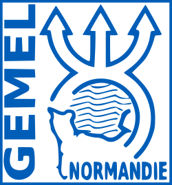
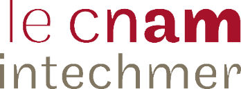
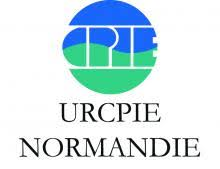
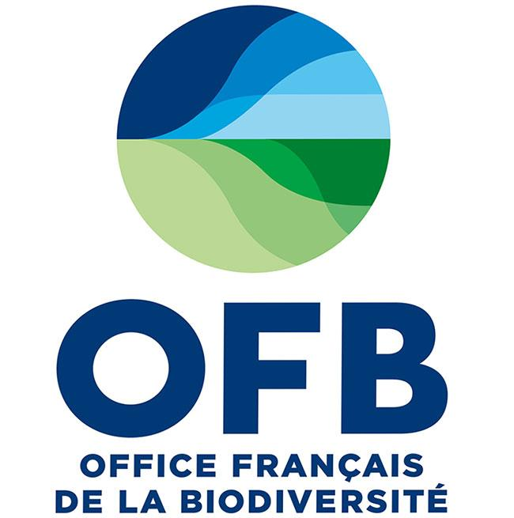

#### [**Le GEMEL-Normandie**](http://www.gemel-normandie.org/)

- *Alexandrine Baffreau* : Chargée de missions - experte en habitats macrobenthiques et cartographie
- *Aurélie Garcia* : Chargée de missions - experte gestion de projet et écologie des communautés macrobenthiques 
- *Olivier Timsit* : Taxonomiste - expert en écologie des communautés macrobenthiques

#### [**Le Cnam-Intechmer**](http://www.intechmer.cnam.fr/l-institut/)

- *Régis Gallon* : Maitre de conférences - expert en écologie numérique - phycologue macrobenthique. Expérience en gestion et analyses de bases de données environnementales et biologiques.

#### [**L'URCPIE Normandie**](https://www.urcpie-normandie.com/)

- *Léa Brieau* : Animatrice de l'Observatoire des activités de Pêche à pied de loisir sur la façade Manche-Mer du Nord

#### [**L'Office Français de la Biodiversité**](https://ofb.gouv.fr/)

- *Elodie GAMP* : Chargée de mission "indicateurs et développements informatiques pour la gestion du milieu marin"